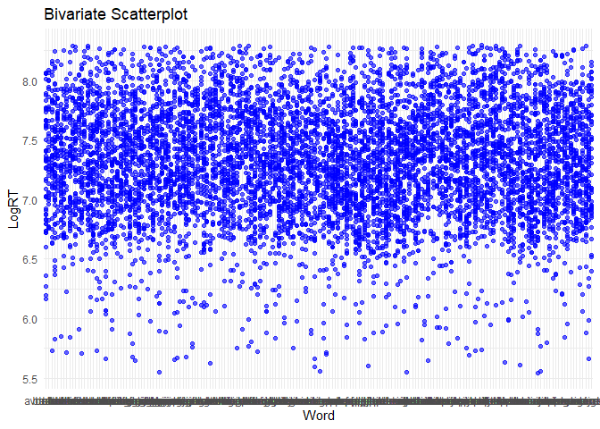
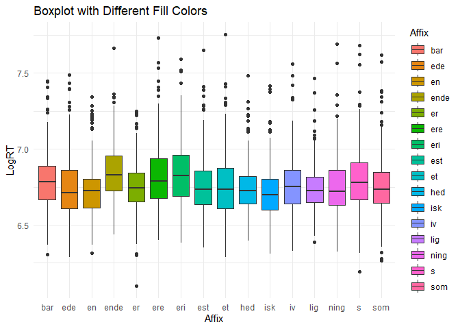
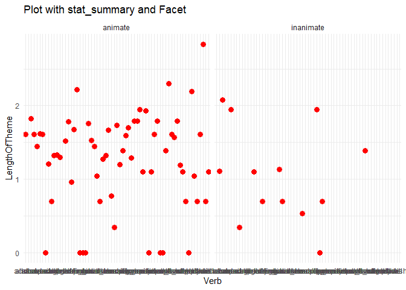

``` r
library('languageR')
```

```
## Warning: package 'languageR' was built under R version 4.4.2
```

``` r
library(ggplot2)
```

```
## Warning: package 'ggplot2' was built under R version 4.4.2
```

``` r
#beginningReaders
# 1. Bivariate scatterplot (using beginningReaders)
ggplot(beginningReaders, aes(x = Word, y = LogRT)) +
  geom_point(color = "blue", alpha = 0.6) +
  labs(title = "Bivariate Scatterplot", x = "Word", y = "LogRT") +
  theme_minimal()
```

<!-- -->

``` r
#danish
# 2. Boxplot with different fill colors (using danish)
ggplot(danish, aes(x = Affix, y = LogRT, fill = Affix)) +
  geom_boxplot() +
  labs(title = "Boxplot with Different Fill Colors", x = "Affix", y = "LogRT") +
  theme_minimal()
```

<!-- -->

``` r
#dativeSimplified
# 3. Plot with stat_summary and facet (using dativeSimplified)
ggplot(dativeSimplified, aes(x = Verb, y = LengthOfTheme)) +
  stat_summary(fun = mean, geom = "point", color = "red", size = 3) +
  facet_wrap(~ AnimacyOfRec) +
  labs(title = "Plot with stat_summary and Facet", x = "Verb", y = "LengthOfTheme") +
  theme_minimal()
```

<!-- -->

