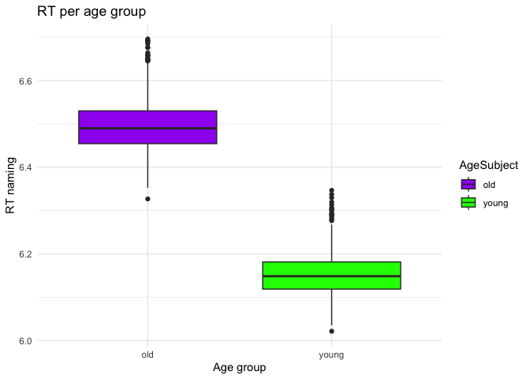
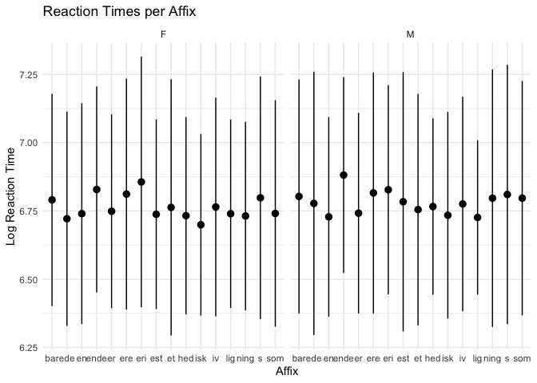

``` r
library(languageR)
library(tidyverse)
```

```
## ── Attaching core tidyverse packages ──────────────────────── tidyverse 2.0.0 ──
## ✔ dplyr     1.1.4     ✔ readr     2.1.5
## ✔ forcats   1.0.0     ✔ stringr   1.5.1
## ✔ ggplot2   3.5.1     ✔ tibble    3.2.1
## ✔ lubridate 1.9.4     ✔ tidyr     1.3.1
## ✔ purrr     1.0.2     
## ── Conflicts ────────────────────────────────────────── tidyverse_conflicts() ──
## ✖ dplyr::filter() masks stats::filter()
## ✖ dplyr::lag()    masks stats::lag()
## ℹ Use the conflicted package (<http://conflicted.r-lib.org/>) to force all conflicts to become errors
```

``` r
glimpse(danish)  
```

```
## Rows: 3,326
## Columns: 16
## $ Subject        <fct> 2s14, 2s17, 2s15, 2s04, 2s06, 2s11, 2s12, 2s21, 2s10, 2…
## $ Word           <fct> appetitlig, appetitlig, appetitlig, appetitlig, appetit…
## $ Affix          <fct> lig, lig, lig, lig, lig, lig, lig, lig, lig, lig, lig, …
## $ LogRT          <dbl> 6.454239, 6.842854, 6.839958, 6.834507, 6.795191, 7.062…
## $ PC1            <dbl> 0.54386019, 1.12905978, 0.65494605, -1.26022096, 0.1668…
## $ PC2            <dbl> -0.23308422, -0.48604403, 0.24700862, -2.43323446, 0.44…
## $ PrevError      <fct> CORRECT, CORRECT, CORRECT, CORRECT, CORRECT, CORRECT, C…
## $ Rank           <dbl> 1.1293305, -0.8380413, -0.7572909, 0.8503748, 0.1015990…
## $ Sex            <fct> M, M, M, M, F, M, F, F, M, M, M, F, F, F, F, F, F, F, F…
## $ ResidSemRating <dbl> -1.234894, -1.234894, -1.234894, -1.234894, -1.234894, …
## $ ResidFamSize   <dbl> -1.60350021, -1.60350021, -1.60350021, -1.60350021, -1.…
## $ LogWordFreq    <dbl> 2.944439, 2.944439, 2.944439, 2.944439, 2.944439, 2.944…
## $ LogAffixFreq   <dbl> 13.40718, 13.40718, 13.40718, 13.40718, 13.40718, 13.40…
## $ LogCUP         <dbl> 6.463029, 6.463029, 6.463029, 6.463029, 6.463029, 6.463…
## $ LogUP          <dbl> 5.323010, 5.323010, 5.323010, 5.323010, 5.323010, 5.323…
## $ LogCUPtoEnd    <dbl> 4.304065, 4.304065, 4.304065, 4.304065, 4.304065, 4.304…
```

``` r
glimpse(english)
```

```
## Rows: 4,568
## Columns: 36
## $ RTlexdec                        <dbl> 6.543754, 6.397596, 6.304942, 6.424221…
## $ RTnaming                        <dbl> 6.145044, 6.246882, 6.143756, 6.131878…
## $ Familiarity                     <dbl> 2.37, 4.43, 5.60, 3.87, 3.93, 3.27, 3.…
## $ Word                            <fct> doe, whore, stress, pork, plug, prop, …
## $ AgeSubject                      <fct> young, young, young, young, young, you…
## $ WordCategory                    <fct> N, N, N, N, N, N, N, N, N, N, N, N, N,…
## $ WrittenFrequency                <dbl> 3.9120230, 4.5217886, 6.5057841, 5.017…
## $ WrittenSpokenFrequencyRatio     <dbl> 1.02165125, 0.35048297, 2.08935600, -0…
## $ FamilySize                      <dbl> 1.3862944, 1.3862944, 1.6094379, 1.945…
## $ DerivationalEntropy             <dbl> 0.14144, 0.42706, 0.06197, 0.43035, 0.…
## $ InflectionalEntropy             <dbl> 0.02114, 0.94198, 1.44339, 0.00000, 1.…
## $ NumberSimplexSynsets            <dbl> 0.6931472, 1.0986123, 2.4849066, 1.098…
## $ NumberComplexSynsets            <dbl> 0.000000, 0.000000, 1.945910, 2.639057…
## $ LengthInLetters                 <int> 3, 5, 6, 4, 4, 4, 4, 3, 3, 5, 5, 3, 5,…
## $ Ncount                          <int> 8, 5, 0, 8, 3, 9, 6, 13, 3, 3, 1, 9, 1…
## $ MeanBigramFrequency             <dbl> 7.036333, 9.537878, 9.883931, 8.309180…
## $ FrequencyInitialDiphone         <dbl> 12.02268, 12.59780, 13.30069, 12.07807…
## $ ConspelV                        <int> 10, 20, 10, 5, 17, 19, 10, 13, 1, 7, 1…
## $ ConspelN                        <dbl> 3.737670, 7.870930, 6.693324, 6.677083…
## $ ConphonV                        <int> 41, 38, 13, 6, 17, 21, 13, 7, 11, 14, …
## $ ConphonN                        <dbl> 8.837826, 9.775825, 7.040536, 3.828641…
## $ ConfriendsV                     <int> 8, 20, 10, 4, 17, 19, 10, 6, 0, 7, 14,…
## $ ConfriendsN                     <dbl> 3.295837, 7.870930, 6.693324, 3.526361…
## $ ConffV                          <dbl> 0.6931472, 0.0000000, 0.0000000, 0.693…
## $ ConffN                          <dbl> 2.7080502, 0.0000000, 0.0000000, 6.634…
## $ ConfbV                          <dbl> 3.4965076, 2.9444390, 1.3862944, 1.098…
## $ ConfbN                          <dbl> 8.833900, 9.614738, 5.817111, 2.564949…
## $ NounFrequency                   <int> 49, 142, 565, 150, 170, 125, 582, 2061…
## $ VerbFrequency                   <int> 0, 0, 473, 0, 120, 280, 110, 76, 4, 86…
## $ CV                              <fct> C, C, C, C, C, C, C, C, V, C, C, V, C,…
## $ Obstruent                       <fct> obst, obst, obst, obst, obst, obst, ob…
## $ Frication                       <fct> burst, frication, frication, burst, bu…
## $ Voice                           <fct> voiced, voiceless, voiceless, voiceles…
## $ FrequencyInitialDiphoneWord     <dbl> 10.129308, 9.054388, 12.422026, 10.048…
## $ FrequencyInitialDiphoneSyllable <dbl> 10.409763, 9.148252, 13.127395, 11.003…
## $ CorrectLexdec                   <int> 27, 30, 30, 30, 26, 28, 30, 28, 25, 29…
```

``` r
glimpse(spanishFunctionWords)
```

```
## Rows: 120
## Columns: 15
## $ X14458gll <dbl> 0.008159, 0.002331, 0.002331, 0.006993, 0.003497, 0.002331, …
## $ X14463gll <dbl> 0.000938, 0.004690, 0.001876, 0.016886, 0.000000, 0.001876, …
## $ X14459gll <dbl> 0.000000, 0.002301, 0.002301, 0.021864, 0.003452, 0.001151, …
## $ X14464gll <dbl> 0.001015, 0.002030, 0.002030, 0.014213, 0.002030, 0.001015, …
## $ X14460gll <dbl> 0.000609, 0.000000, 0.007922, 0.013406, 0.000609, 0.001219, …
## $ X14465gll <dbl> 0.000667, 0.002000, 0.002667, 0.016000, 0.001333, 0.001333, …
## $ X14461gll <dbl> 0.000617, 0.004316, 0.003083, 0.021578, 0.003083, 0.003699, …
## $ X14466gll <dbl> 0.002596, 0.000649, 0.002596, 0.013628, 0.001947, 0.001298, …
## $ X14462gll <dbl> 0.003470, 0.000578, 0.002313, 0.009832, 0.000578, 0.000578, …
## $ X14472gll <dbl> 0.000659, 0.003955, 0.003296, 0.015821, 0.000659, 0.000000, …
## $ X14467gll <dbl> 0.002594, 0.002594, 0.001946, 0.018158, 0.000000, 0.001946, …
## $ X14473gll <dbl> 0.004988, 0.001870, 0.001870, 0.010599, 0.003117, 0.000000, …
## $ X14474gll <dbl> 0.002045, 0.001363, 0.000682, 0.019087, 0.002727, 0.000682, …
## $ X14475gll <dbl> 0.000679, 0.002038, 0.003397, 0.012908, 0.000679, 0.001359, …
## $ X14476gll <dbl> 0.000000, 0.003211, 0.003211, 0.017983, 0.001927, 0.000642, …
```

``` r
glimpse(dativeSimplified)
```

```
## Rows: 903
## Columns: 5
## $ RealizationOfRec <fct> NP, NP, NP, NP, NP, NP, NP, NP, NP, NP, NP, NP, NP, N…
## $ Verb             <fct> feed, give, give, give, offer, give, pay, bring, teac…
## $ AnimacyOfRec     <fct> animate, animate, animate, animate, animate, animate,…
## $ AnimacyOfTheme   <fct> inanimate, inanimate, inanimate, inanimate, inanimate…
## $ LengthOfTheme    <dbl> 2.6390573, 1.0986123, 2.5649494, 1.6094379, 1.0986123…
```

``` r
glimpse(beginningReaders)
```

```
## Rows: 7,923
## Columns: 13
## $ Word               <fct> avontuur, avontuur, avontuur, avontuur, avontuur, a…
## $ Subject            <fct> S28, S40, S37, S65, S54, S43, S34, S47, S61, S39, S…
## $ LogRT              <dbl> 7.410347, 8.065894, 6.739337, 7.021976, 7.167809, 7…
## $ Trial              <int> 190, 298, 172, 295, 74, 446, 94, 415, 342, 361, 78,…
## $ OrthLength         <int> 8, 8, 8, 8, 8, 8, 8, 8, 8, 8, 8, 8, 8, 8, 8, 8, 8, …
## $ LogFrequency       <dbl> 4.394449, 4.394449, 4.394449, 4.394449, 4.394449, 4…
## $ LogFamilySize      <dbl> 1.609438, 1.609438, 1.609438, 1.609438, 1.609438, 1…
## $ ReadingScore       <int> 39, 34, 61, 66, 41, 23, 28, 60, 87, 39, 49, 86, 54,…
## $ ProportionOfErrors <dbl> 0.0877193, 0.0877193, 0.0877193, 0.0877193, 0.08771…
## $ PC1                <dbl> -0.42677077, 0.88301831, -1.00752385, -0.12358643, …
## $ PC2                <dbl> 0.178975966, -0.590835352, 0.373581513, 0.120818209…
## $ PC3                <dbl> 0.099767967, -0.928297160, -0.002442806, 0.76437702…
## $ PC4                <dbl> 0.10309743, -1.65831762, -0.01558577, 0.38848318, -…
```


# 1. Scatter plot: Beginning Readers


``` r
beginningReaders |>
  ggplot() +
  aes(x = LogFrequency, y = ProportionOfErrors) +  
  stat_summary(fun="mean", geom="point")+
  labs(x = "Log Frequency", y = "Proportion of errors", title = "Log Frequency and proportion of errors") + 
  theme_minimal()  
```

<!-- -->


#2. Boxplot: English


``` r
english$AgeSubject <- as.factor(english$AgeSubject)
```


``` r
english |>  
  ggplot() +  
  (aes(x = AgeSubject, y = RTnaming, fill = AgeSubject)) +  
  geom_boxplot(outlier.shape = 21, outlier.color = "black", outlier.fill = "white") +  
  scale_fill_manual(values = c("young" = "green", "old" = "purple")) +  
  labs(x = "Age group", y = "RT naming", title = "RT per age group") +  
  theme_minimal()
```

<!-- -->


#3. Point range: Danish

``` r
danish |>
  ggplot() +
  aes(x = Affix, y = LogRT) + 
  facet_grid(. ~ Sex) +
  stat_summary(fun.data ="mean_sdl", geom= "pointrange") +  
  labs(x = "Affix", y = "Log Reaction Time", title = "Reaction Times per Affix") + 
  theme_minimal()  
```

<!-- -->


