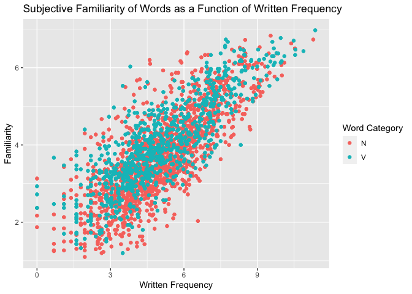
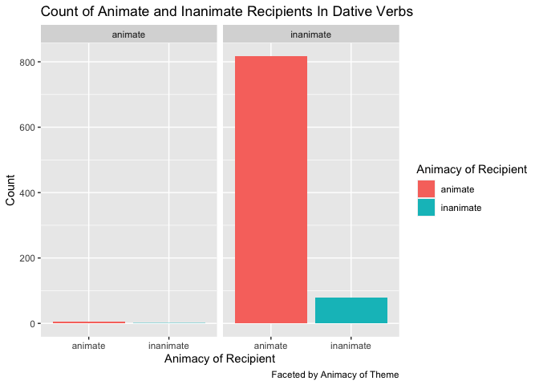

```r
english %>%
  ggplot() +
  aes(x=round(WrittenFrequency,2), y=round(Familiarity,2),color=factor(WordCategory)) +
  ggtitle("Subjective Familiarity of Words as a Function of Written Frequency") +
  xlab("Written Frequency") +
  ylab("Familiarity") +
  labs(color="Word Category") +
  geom_point()
```

<!-- -->


```r
beginningReaders %>%
  ggplot() +
  aes(x=OrthLength, y=LogFrequency, fill=factor(OrthLength)) +
  ggtitle("Word Frequency in Dutch Children's Books as a Function Word Length") +
  xlab("Word Length") +
  ylab("Frequency in Children's Books") +
  labs(fill="Word Length") +
  scale_fill_brewer(palette="Spectral") +
  geom_boxplot()
```

<!-- -->


```r
dativeSimplified %>%
  ggplot() +
  aes(x=AnimacyOfRec, fill=factor(AnimacyOfRec), width=0.5) +
  facet_wrap(~AnimacyOfTheme) +
  labs(title="Count of Animate and Inanimate Recipients In Dative Verbs", x="Animacy of Recipient", y="Count", fill ="Animacy of Recipient", caption="Faceted by Animacy of Theme") +
  geom_bar()
```

<!-- -->
