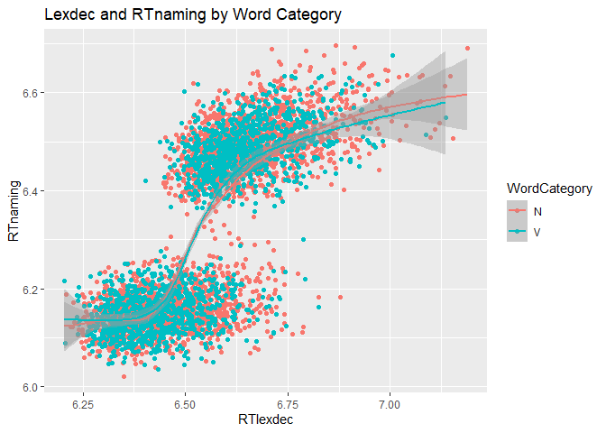
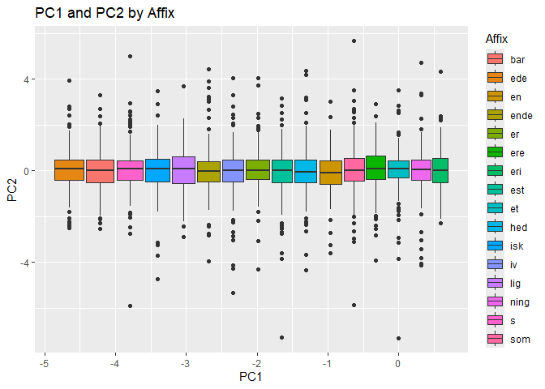
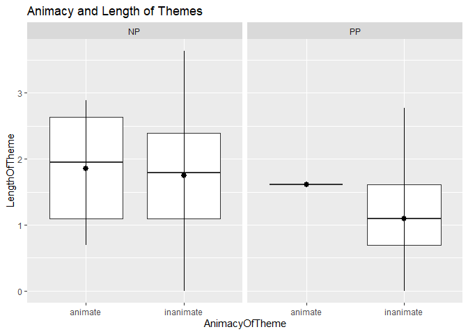

``` r
library("tidyverse")
library("languageR")
```

This is a bivariate scatterplot. 

``` r
ggplot(english) +
  aes(x = RTlexdec, y = RTnaming, color = WordCategory) +
  geom_point() +
  geom_smooth() +
  labs(title = "Lexdec and RTnaming by Word Category")
```



This is a boxplot with different fill colors. 

``` r
ggplot(danish) + 
  aes(x = PC1, y = PC2, fill = Affix) +
  geom_boxplot() +
  labs(title = "PC1 and PC2 by Affix")
```




This is a boxplot with a summary and facets. 

``` r
ggplot(dativeSimplified) +
  aes(x = AnimacyOfTheme, y = LengthOfTheme) +
  geom_boxplot() +
  stat_summary(fun = mean, fun.min = min, fun.max = max) +
  facet_grid(. ~ RealizationOfRec) +
  labs(title = "Animacy and Length of Themes")
```




