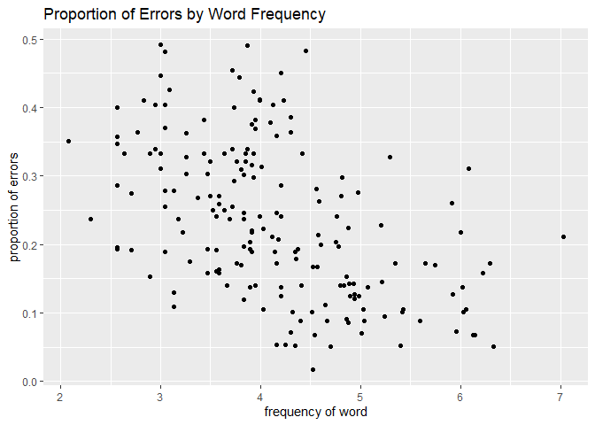
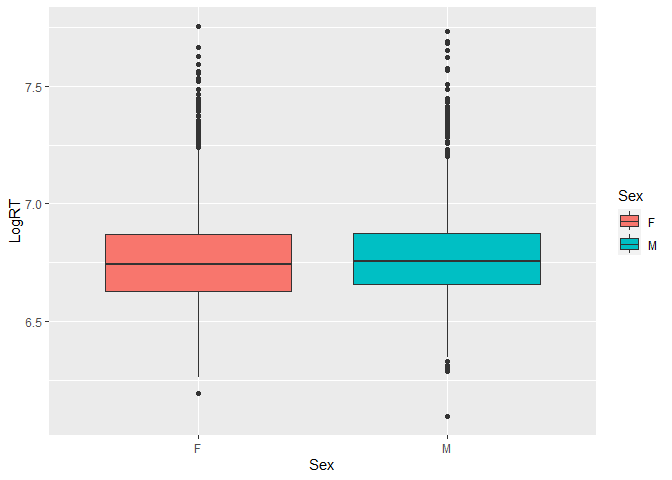
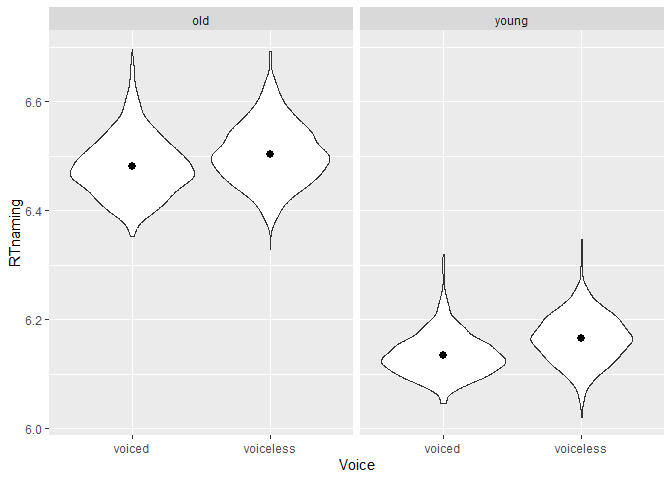

```r
## install.packages('languageR')

library('languageR')
library('tidyverse')
```

```
## ── Attaching packages ─────────────────────────────────────── tidyverse 1.3.2 ──
## ✔ ggplot2 3.4.0      ✔ purrr   1.0.1 
## ✔ tibble  3.1.8      ✔ dplyr   1.0.10
## ✔ tidyr   1.2.1      ✔ stringr 1.5.0 
## ✔ readr   2.1.3      ✔ forcats 0.5.2 
## ── Conflicts ────────────────────────────────────────── tidyverse_conflicts() ──
## ✖ dplyr::filter() masks stats::filter()
## ✖ dplyr::lag()    masks stats::lag()
```


```r
?beginningReaders
?danish
?dativeSimplified
?english
?spanishFunctionWords
?spanishMeta
```


```r
beginningReaders
english
dativeSimplified
danish
spanishFunctionWords
spanishMeta
```


```r
beginningReaders %>%
  ggplot() + 
  aes(x=LogFrequency,y=ProportionOfErrors) +
  geom_point() +
  labs(x="frequency of word",y="proportion of errors",title="Proportion of Errors by Word Frequency")
```

<!-- -->


```r
danish %>%
  ggplot() +
  aes(x=Sex,y=LogRT,fill=Sex) +
  geom_boxplot()
```

<!-- -->


```r
spanishMeta %>%
  ggplot() +
  aes(x=Author,y=PubDate) +
  geom_violin() +
  stat_summary(fun="median")
```

```
## Warning: Removed 3 rows containing missing values (`geom_segment()`).
```

<!-- -->

