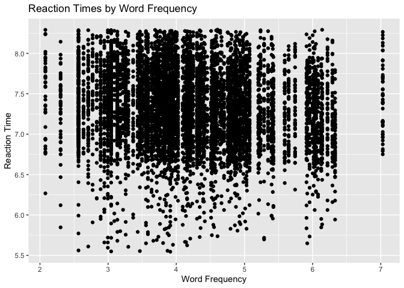
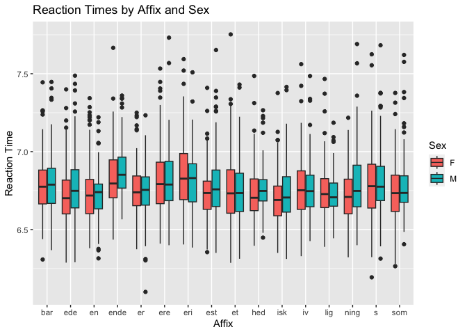

```r
library("tidyverse")
```

```
## ── Attaching packages ─────────────────────────────────────── tidyverse 1.3.2 ──
## ✔ ggplot2 3.4.0     ✔ purrr   1.0.1
## ✔ tibble  3.1.8     ✔ dplyr   1.1.0
## ✔ tidyr   1.3.0     ✔ stringr 1.5.0
## ✔ readr   2.1.3     ✔ forcats 1.0.0
## ── Conflicts ────────────────────────────────────────── tidyverse_conflicts() ──
## ✖ dplyr::filter() masks stats::filter()
## ✖ dplyr::lag()    masks stats::lag()
```

```r
library("languageR")
```


```r
beginningReaders = beginningReaders
danish -> danish
dativeSimplified -> dativeSimplified
english -> english
spanishFunctionWords -> spanishFunctionWords
```

# Bivariate Scatterplot

```r
beginningReaders %>% 
  ggplot() + 
  aes(x = LogFrequency, y = LogRT) + 
  geom_point() +
  labs(y = "Reaction Time", x = "Word Frequency",
       title = "Reaction Times by Word Frequency")
```

<!-- -->

# Boxplot with different fill colors

```r
danish %>% 
  ggplot() + 
  aes(x = Affix, y = LogRT, fill = Sex) + 
  geom_boxplot() +
  labs(x = "Affix", y = "Reaction Time",
       title = "Reaction Times by Affix and Sex")
```

<!-- -->

# Scatterplot with Stat Summary and Facet

```r
english %>% 
  ggplot() + 
  aes(x = WordCategory, y = RTnaming) + 
  facet_grid(. ~ AgeSubject) + 
  stat_summary(fun.data = mean_se, geom = "pointrange", pch = 19) + 
  scale_y_continuous(breaks = seq(0, 10, 2),
                     limits = c(0, 10)) +
  labs(x = "Word Category", y = "Naming Reaction Time",
       title = "Naming Reaction Times by Word Category and Age")
```

<!-- -->

# Comments

I selected the variables and datasets that I wanted to use and I did all the graphs. However, for the last one, I realized that the scale for the y axis was difficult to interpret (it started in 6) and I asked Patrick for help. He helped me to adjust the y axis. I hope it is fine.


