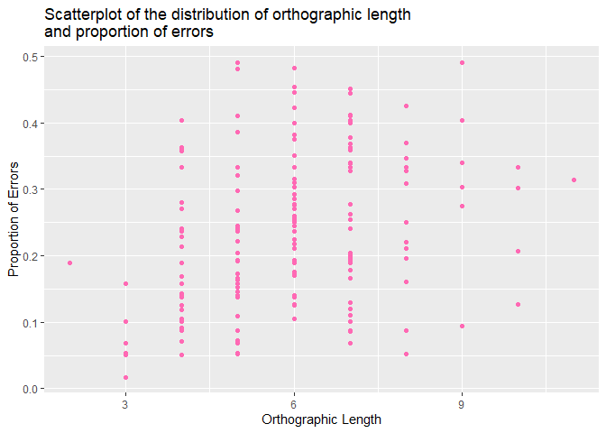
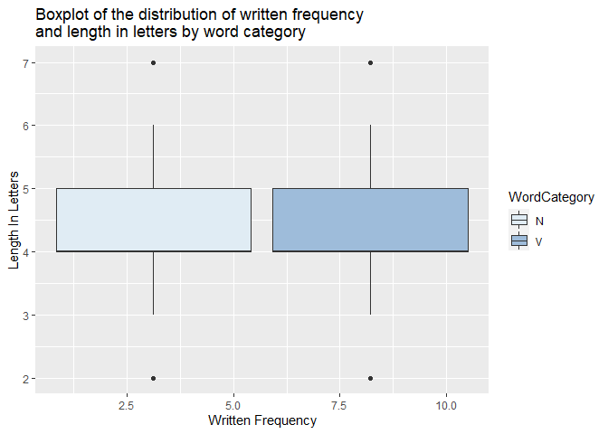
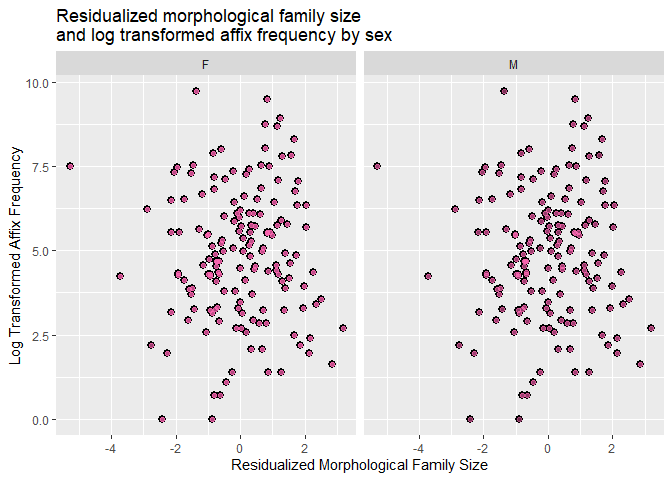

Programming assignment 2
================
Kaylee Fernandez
Last update:2021-02-04 09:39:43

``` r
library(tidyverse)
```

    ## -- Attaching packages --------------------------------------- tidyverse 1.3.0 --

    ## v ggplot2 3.3.3     v purrr   0.3.4
    ## v tibble  3.0.5     v dplyr   1.0.3
    ## v tidyr   1.1.2     v stringr 1.4.0
    ## v readr   1.4.0     v forcats 0.5.1

    ## -- Conflicts ------------------------------------------ tidyverse_conflicts() --
    ## x dplyr::filter() masks stats::filter()
    ## x dplyr::lag()    masks stats::lag()

``` r
library(languageR)
ggplot(data = beginningReaders) + geom_point(mapping = aes(x = OrthLength, y = ProportionOfErrors), color = "hot pink") + xlab("Orthographic Length") + ylab("Proportion of Errors") + ggtitle("Scatterplot of the distribution of orthographic length\nand proportion of errors")
```

<!-- -->

``` r
ggplot(data = english, aes(x = WrittenFrequency, y = LengthInLetters, fill = WordCategory)) + geom_boxplot() + xlab("Written Frequency") + ylab("Length In Letters") + ggtitle("Boxplot of the distribution of written frequency\nand length in letters by word category") + scale_fill_brewer(palette="BuPu")
```

<!-- -->

``` r
ggplot(data = danish) + stat_summary(mapping = aes(x = ResidFamSize, y = LogWordFreq), fun.min = min, fun.max = max, fun = median) + geom_point(data = danish, aes(x = ResidFamSize, y = LogWordFreq), alpha = .1, color = "hot pink") + facet_wrap(~ Sex, nrow = 1)  + xlab("Residualized Morphological Family Size") + ylab("Log Transformed Affix Frequency") + ggtitle("Residualized morphological family size\nand log transformed affix frequency by sex")
```

<!-- -->
