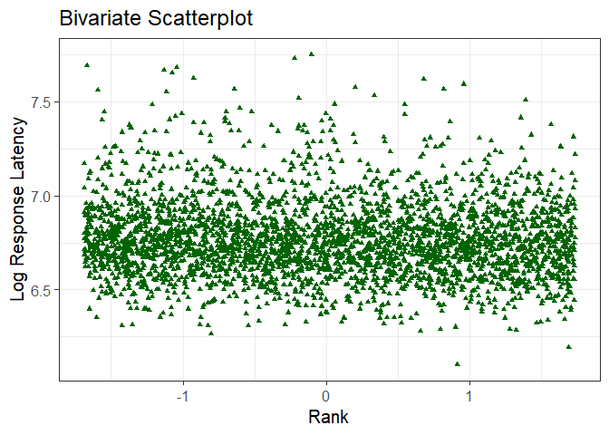
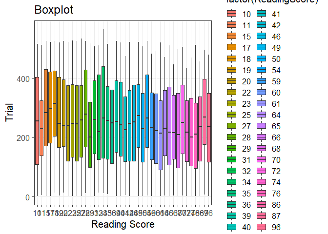
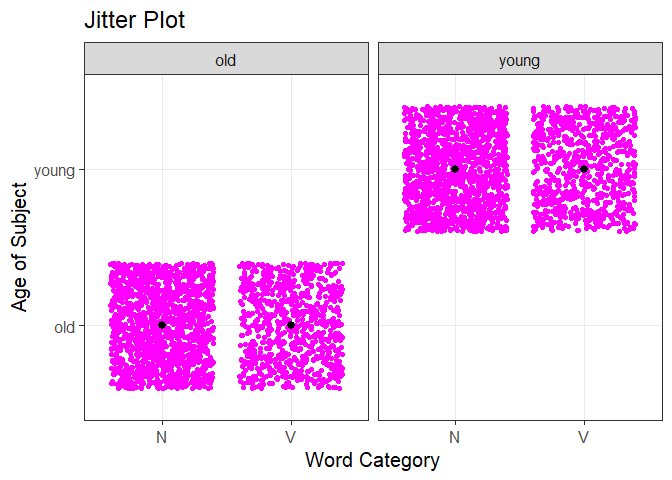

Programming assignment 2
================
Gabriela Constantin-Dureci
Last update:2021-02-04 09:39:43

# Here comes Programming Assignment 2!

## First Plot

``` r
library(tidyverse)
```

    ## -- Attaching packages --------------------------------------- tidyverse 1.3.0 --

    ## v ggplot2 3.3.3     v purrr   0.3.4
    ## v tibble  3.0.5     v dplyr   1.0.3
    ## v tidyr   1.1.2     v stringr 1.4.0
    ## v readr   1.4.0     v forcats 0.5.1

    ## -- Conflicts ------------------------------------------ tidyverse_conflicts() --
    ## x dplyr::filter() masks stats::filter()
    ## x dplyr::lag()    masks stats::lag()

``` r
library(languageR)
danish %>% 
  ggplot(.,aes(x=Rank, y=LogRT))+
  geom_point(color="darkgreen", shape="triangle")+
  labs(x="Rank", y="Log Response Latency", title="Bivariate Scatterplot")+
  theme_bw(base_size = 15)
```

<!-- -->

## Second Plot

``` r
beginningReaders %>% 
  ggplot(.,aes(x=factor(ReadingScore), y=Trial, fill=factor(ReadingScore)))+
  geom_boxplot()+
  labs(x="Reading Score", y="Trial", title="Boxplot")+
    theme_bw(base_size = 15)
```

<!-- -->

## Third Plot

``` r
english %>% 
  ggplot(.,aes(x=WordCategory, y=AgeSubject))+
    geom_jitter(color="magenta", shape="circle")+
  facet_wrap(AgeSubject~.)+
  stat_summary(fun.data=mean_sdl, geom = "pointrange")+
  labs(x="Word Category", y="Age of Subject", title="Jitter Plot")+
  theme_bw(base_size=15)
```

<!-- -->
