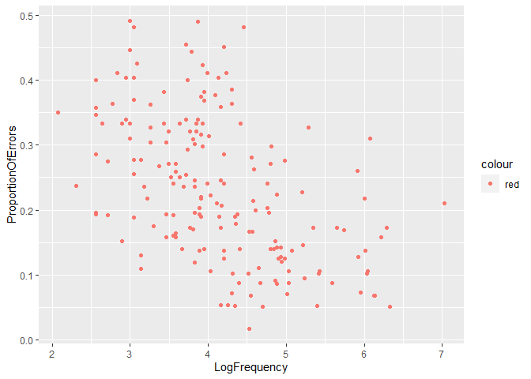
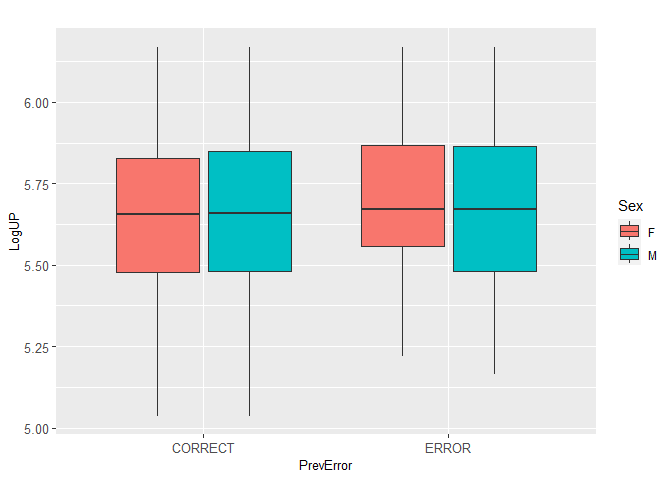
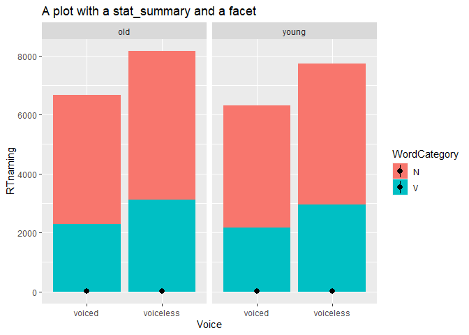

#Libraries 


```r
library(tidyverse)
```

```
## ── Attaching packages ─────────────────────────────────────── tidyverse 1.3.2 ──
## ✔ ggplot2 3.4.0     ✔ purrr   1.0.1
## ✔ tibble  3.1.8     ✔ dplyr   1.1.0
## ✔ tidyr   1.3.0     ✔ stringr 1.5.0
## ✔ readr   2.1.3     ✔ forcats 1.0.0
## ── Conflicts ────────────────────────────────────────── tidyverse_conflicts() ──
## ✖ dplyr::filter() masks stats::filter()
## ✖ dplyr::lag()    masks stats::lag()
```

```r
library(languageR)
  data(package="languageR")
```

#Plot 1

##Data familiarization beginningReaders


```r
data(beginningReaders)
summary(beginningReaders)
```

```
##        Word         Subject         LogRT           Trial      
##  mus     :  56   S46    : 180   Min.   :5.545   Min.   :  1.0  
##  poes    :  56   S52    : 177   1st Qu.:7.001   1st Qu.:126.0  
##  sok     :  56   S12    : 174   Median :7.329   Median :242.0  
##  oom     :  55   S63    : 174   Mean   :7.318   Mean   :247.8  
##  plein   :  55   S74    : 172   3rd Qu.:7.657   3rd Qu.:370.0  
##  sprookje:  55   S75    : 171   Max.   :8.294   Max.   :567.0  
##  (Other) :7590   (Other):6875                                  
##    OrthLength      LogFrequency   LogFamilySize    ReadingScore  
##  Min.   : 2.000   Min.   :2.079   Min.   :0.000   Min.   :10.00  
##  1st Qu.: 5.000   1st Qu.:3.584   1st Qu.:1.099   1st Qu.:29.00  
##  Median : 6.000   Median :4.143   Median :1.386   Median :46.00  
##  Mean   : 5.769   Mean   :4.218   Mean   :1.504   Mean   :47.61  
##  3rd Qu.: 7.000   3rd Qu.:4.860   3rd Qu.:1.792   3rd Qu.:65.00  
##  Max.   :11.000   Max.   :7.029   Max.   :3.807   Max.   :96.00  
##                                                                  
##  ProportionOfErrors      PC1                PC2                 PC3          
##  Min.   :0.01754    Min.   :-6.74895   Min.   :-3.571122   Min.   :-3.35566  
##  1st Qu.:0.13793    1st Qu.:-0.85291   1st Qu.:-0.461370   1st Qu.:-0.43199  
##  Median :0.19643    Median : 0.20943   Median :-0.009402   Median :-0.00131  
##  Mean   :0.21607    Mean   : 0.04015   Mean   : 0.000145   Mean   :-0.00295  
##  3rd Qu.:0.29825    3rd Qu.: 1.13255   3rd Qu.: 0.462891   3rd Qu.: 0.41571  
##  Max.   :0.49123    Max.   : 3.38085   Max.   : 4.172695   Max.   : 2.97171  
##                                                                              
##       PC4           
##  Min.   :-3.055159  
##  1st Qu.:-0.405996  
##  Median : 0.005431  
##  Mean   : 0.002121  
##  3rd Qu.: 0.412868  
##  Max.   : 2.926385  
## 
```

```r
head(beginningReaders)
```

```
##       Word Subject    LogRT Trial OrthLength LogFrequency LogFamilySize
## 1 avontuur     S28 7.410347   190          8     4.394449      1.609438
## 2 avontuur     S40 8.065894   298          8     4.394449      1.609438
## 3 avontuur     S37 6.739337   172          8     4.394449      1.609438
## 4 avontuur     S65 7.021976   295          8     4.394449      1.609438
## 5 avontuur     S54 7.167809    74          8     4.394449      1.609438
## 6 avontuur     S43 7.628518   446          8     4.394449      1.609438
##   ReadingScore ProportionOfErrors        PC1        PC2          PC3
## 1           39          0.0877193 -0.4267708  0.1789760  0.099767967
## 2           34          0.0877193  0.8830183 -0.5908354 -0.928297160
## 3           61          0.0877193 -1.0075239  0.3735815 -0.002442806
## 4           66          0.0877193 -0.1235864  0.1208182  0.764377023
## 5           41          0.0877193 -0.4886353 -0.9584474  0.193079488
## 6           23          0.0877193  1.8644799  0.7346544 -0.280724884
##           PC4
## 1  0.10309743
## 2 -1.65831762
## 3 -0.01558577
## 4  0.38848318
## 5 -1.28002946
## 6  0.14591764
```

```r
tail(beginningReaders)
```

```
##         Word Subject    LogRT Trial OrthLength LogFrequency LogFamilySize
## 7918 zwijgen     S22 7.649693   312          7     4.521789      2.079442
## 7919 zwijgen     S61 6.849066   225          7     4.521789      2.079442
## 7920 zwijgen     S53 7.308543   187          7     4.521789      2.079442
## 7921 zwijgen     S67 6.396930   507          7     4.521789      2.079442
## 7922 zwijgen     S70 7.894318   481          7     4.521789      2.079442
## 7923 zwijgen     S15 6.888572    21          7     4.521789      2.079442
##      ReadingScore ProportionOfErrors        PC1        PC2        PC3
## 7918           25          0.1666667 -0.3052795 -1.4230092 -0.2895704
## 7919           87          0.1666667 -0.4736820 -0.9378777  0.1896267
## 7920           64          0.1666667  0.5956993 -0.3424532  1.5597755
## 7921           42          0.1666667 -1.9366430 -0.3954460 -1.4966767
## 7922           42          0.1666667 -0.3850145  0.7527641  0.6666366
## 7923           50          0.1666667  1.4501780 -0.9583802 -0.2224484
##              PC4
## 7918  0.80256044
## 7919  0.29277640
## 7920 -0.23587292
## 7921  0.25181804
## 7922  0.81729332
## 7923  0.01223736
```


```r
ggplot(data = beginningReaders) + 
  geom_point(mapping = aes(x = LogFrequency, y = ProportionOfErrors, color = "red", ))
```

<!-- -->


##Data familiarization danish


```r
data(danish)
summary(danish)
```

```
##     Subject             Word          Affix          LogRT      
##  2s08   : 155   appetitlig:  22   est    : 217   Min.   :6.100  
##  2s02   : 154   baroner   :  22   isk    : 217   1st Qu.:6.643  
##  2s11   : 154   bF8jning  :  22   et     : 216   Median :6.748  
##  2s18   : 154   blokere   :  22   ede    : 215   Mean   :6.770  
##  2s21   : 154   blomster  :  22   hed    : 215   3rd Qu.:6.873  
##  2s10   : 153   bryggeri  :  22   er     : 214   Max.   :7.752  
##  (Other):2402   (Other)   :3194   (Other):2032                  
##       PC1               PC2             PrevError         Rank          
##  Min.   :-6.3661   Min.   :-7.30414   CORRECT:3182   Min.   :-1.689590  
##  1st Qu.:-0.3934   1st Qu.:-0.46991   ERROR  : 144   1st Qu.:-0.882087  
##  Median : 0.1915   Median : 0.01951                  Median :-0.001174  
##  Mean   : 0.0000   Mean   : 0.00000                  Mean   : 0.000000  
##  3rd Qu.: 0.6469   3rd Qu.: 0.48517                  3rd Qu.: 0.850375  
##  Max.   : 2.1024   Max.   : 5.65189                  Max.   : 1.738628  
##                                                                         
##  Sex      ResidSemRating       ResidFamSize        LogWordFreq   
##  F:1972   Min.   :-3.550223   Min.   :-5.284262   Min.   :0.000  
##  M:1354   1st Qu.:-1.065771   1st Qu.:-0.826234   1st Qu.:3.466  
##           Median : 0.282918   Median : 0.065899   Median :4.860  
##           Mean   : 0.004871   Mean   : 0.007872   Mean   :4.898  
##           3rd Qu.: 1.339696   3rd Qu.: 0.919535   3rd Qu.:6.196  
##           Max.   : 2.523988   Max.   : 3.178727   Max.   :9.736  
##                                                                  
##   LogAffixFreq        LogCUP          LogUP        LogCUPtoEnd   
##  Min.   : 9.066   Min.   :5.565   Min.   :5.037   Min.   :0.000  
##  1st Qu.:11.004   1st Qu.:5.994   1st Qu.:5.478   1st Qu.:4.078  
##  Median :12.416   Median :6.129   Median :5.659   Median :4.898  
##  Mean   :12.000   Mean   :6.131   Mean   :5.661   Mean   :4.173  
##  3rd Qu.:13.395   3rd Qu.:6.267   3rd Qu.:5.849   3rd Qu.:5.236  
##  Max.   :14.060   Max.   :6.525   Max.   :6.170   Max.   :5.805  
## 
```

```r
head(danish)
```

```
##   Subject       Word Affix    LogRT        PC1        PC2 PrevError       Rank
## 1    2s14 appetitlig   lig 6.454239  0.5438602 -0.2330842   CORRECT  1.1293305
## 2    2s17 appetitlig   lig 6.842854  1.1290598 -0.4860440   CORRECT -0.8380413
## 3    2s15 appetitlig   lig 6.839958  0.6549460  0.2470086   CORRECT -0.7572909
## 4    2s04 appetitlig   lig 6.834507 -1.2602210 -2.4332345   CORRECT  0.8503748
## 5    2s06 appetitlig   lig 6.795191  0.1668297  0.4430017   CORRECT  0.1015990
## 6    2s11 appetitlig   lig 7.062680 -0.2500449  0.1067010   CORRECT  0.3732137
##   Sex ResidSemRating ResidFamSize LogWordFreq LogAffixFreq   LogCUP   LogUP
## 1   M      -1.234894      -1.6035    2.944439     13.40718 6.463029 5.32301
## 2   M      -1.234894      -1.6035    2.944439     13.40718 6.463029 5.32301
## 3   M      -1.234894      -1.6035    2.944439     13.40718 6.463029 5.32301
## 4   M      -1.234894      -1.6035    2.944439     13.40718 6.463029 5.32301
## 5   F      -1.234894      -1.6035    2.944439     13.40718 6.463029 5.32301
## 6   M      -1.234894      -1.6035    2.944439     13.40718 6.463029 5.32301
##   LogCUPtoEnd
## 1    4.304065
## 2    4.304065
## 3    4.304065
## 4    4.304065
## 5    4.304065
## 6    4.304065
```

```r
tail(danish)
```

```
##      Subject     Word Affix    LogRT        PC1        PC2 PrevError       Rank
## 3321    2s03 E5benbar   bar 6.826285 -2.6379857  0.2081891   CORRECT -1.1683836
## 3322    2s19 E5benbar   bar 6.770801  0.4434406  0.9100121   CORRECT  1.6064915
## 3323    2s10 E5benbar   bar 6.862946 -0.1982878  0.7644656   CORRECT  1.3715815
## 3324    2s13 E5benbar   bar 6.645988  1.1441186  0.2800778   CORRECT -0.4930171
## 3325    2s15 E5benbar   bar 6.784864  0.5092314 -0.8018199   CORRECT -0.7059044
## 3326    2s22 E5benbar   bar 6.918903  0.1314924  0.5327833   CORRECT  0.3952365
##      Sex ResidSemRating ResidFamSize LogWordFreq LogAffixFreq   LogCUP    LogUP
## 3321   M      -2.027178    0.4435118    4.543295     9.065661 5.986452 5.723585
## 3322   F      -2.027178    0.4435118    4.543295     9.065661 5.986452 5.723585
## 3323   M      -2.027178    0.4435118    4.543295     9.065661 5.986452 5.723585
## 3324   F      -2.027178    0.4435118    4.543295     9.065661 5.986452 5.723585
## 3325   M      -2.027178    0.4435118    4.543295     9.065661 5.986452 5.723585
## 3326   F      -2.027178    0.4435118    4.543295     9.065661 5.986452 5.723585
##      LogCUPtoEnd
## 3321    5.493061
## 3322    5.493061
## 3323    5.493061
## 3324    5.493061
## 3325    5.493061
## 3326    5.493061
```


```r
danish %>%
  ggplot() +
  aes(x = PrevError, y = LogUP, fill = Sex) + geom_boxplot() + labs(x = "PrevError", y = "LogUP", title = "Un boxplot") + 
  theme(axis.title=element_text(size=10),
        axis.text.x = element_text(size=10), 
        axis.text.y = element_text(size=10),
        plot.title=element_text(size=10, hjust = 10))
```

<!-- -->


##Data familiarization english

```r
data(english)
summary(english)
```

```
##     RTlexdec        RTnaming      Familiarity         Word      AgeSubject  
##  Min.   :6.205   Min.   :6.022   Min.   :1.100   arm    :   4   old  :2284  
##  1st Qu.:6.426   1st Qu.:6.149   1st Qu.:3.000   barge  :   4   young:2284  
##  Median :6.550   Median :6.342   Median :3.700   bark   :   4               
##  Mean   :6.550   Mean   :6.323   Mean   :3.796   bear   :   4               
##  3rd Qu.:6.653   3rd Qu.:6.490   3rd Qu.:4.570   beef   :   4               
##  Max.   :7.188   Max.   :6.696   Max.   :6.970   bind   :   4               
##                                                  (Other):4544               
##  WordCategory WrittenFrequency WrittenSpokenFrequencyRatio   FamilySize    
##  N:2904       Min.   : 0.000   Min.   :-6.55393            Min.   :0.6931  
##  V:1664       1st Qu.: 3.761   1st Qu.:-0.07402            1st Qu.:1.0986  
##               Median : 4.832   Median : 0.68118            Median :1.7918  
##               Mean   : 5.021   Mean   : 0.67763            Mean   :1.8213  
##               3rd Qu.: 6.247   3rd Qu.: 1.44146            3rd Qu.:2.3026  
##               Max.   :11.357   Max.   : 5.63071            Max.   :5.5175  
##                                                                            
##  DerivationalEntropy InflectionalEntropy NumberSimplexSynsets
##  Min.   :0.00000     Min.   :0.0000      Min.   :0.000       
##  1st Qu.:0.03932     1st Qu.:0.7442      1st Qu.:1.099       
##  Median :0.41097     Median :1.0982      Median :1.609       
##  Mean   :0.54089     Mean   :1.1186      Mean   :1.708       
##  3rd Qu.:0.89323     3rd Qu.:1.6325      3rd Qu.:2.197       
##  Max.   :5.20728     Max.   :2.4514      Max.   :4.357       
##                                                              
##  NumberComplexSynsets LengthInLetters     Ncount       MeanBigramFrequency
##  Min.   :0.000        Min.   :2.000   Min.   : 0.000   Min.   : 5.390     
##  1st Qu.:0.000        1st Qu.:4.000   1st Qu.: 2.000   1st Qu.: 8.100     
##  Median :1.386        Median :4.000   Median : 5.000   Median : 8.559     
##  Mean   :1.568        Mean   :4.342   Mean   : 6.266   Mean   : 8.490     
##  3rd Qu.:2.565        3rd Qu.:5.000   3rd Qu.: 9.000   3rd Qu.: 8.973     
##  Max.   :6.111        Max.   :7.000   Max.   :22.000   Max.   :10.283     
##                                                                           
##  FrequencyInitialDiphone    ConspelV        ConspelN         ConphonV    
##  Min.   : 4.143          Min.   : 0.00   Min.   : 0.000   Min.   : 0.00  
##  1st Qu.:11.277          1st Qu.: 6.00   1st Qu.: 4.519   1st Qu.:10.00  
##  Median :12.023          Median :11.00   Median : 5.710   Median :16.00  
##  Mean   :11.963          Mean   :11.71   Mean   : 5.605   Mean   :18.26  
##  3rd Qu.:12.697          3rd Qu.:17.00   3rd Qu.: 6.997   3rd Qu.:24.00  
##  Max.   :14.654          Max.   :32.00   Max.   :10.492   Max.   :66.00  
##                                                                          
##     ConphonN       ConfriendsV     ConfriendsN         ConffV      
##  Min.   : 0.000   Min.   : 0.00   Min.   : 0.000   Min.   :0.0000  
##  1st Qu.: 5.268   1st Qu.: 4.00   1st Qu.: 4.159   1st Qu.:0.0000  
##  Median : 6.340   Median :10.00   Median : 5.487   Median :0.0000  
##  Mean   : 6.318   Mean   :10.42   Mean   : 5.265   Mean   :0.4109  
##  3rd Qu.: 7.491   3rd Qu.:15.00   3rd Qu.: 6.642   3rd Qu.:0.6931  
##  Max.   :10.600   Max.   :31.00   Max.   :10.303   Max.   :3.3322  
##                                                                    
##      ConffN           ConfbV           ConfbN       NounFrequency     
##  Min.   : 0.000   Min.   :0.0000   Min.   : 0.000   Min.   :    0.00  
##  1st Qu.: 0.000   1st Qu.:0.6931   1st Qu.: 0.000   1st Qu.:   28.75  
##  Median : 0.000   Median :1.3863   Median : 4.143   Median :  108.00  
##  Mean   : 1.308   Mean   :1.5570   Mean   : 3.890   Mean   :  600.19  
##  3rd Qu.: 1.386   3rd Qu.:2.5649   3rd Qu.: 6.242   3rd Qu.:  424.75  
##  Max.   :10.347   Max.   :4.1897   Max.   :10.600   Max.   :35351.00  
##                                                                       
##  VerbFrequency      CV       Obstruent       Frication          Voice     
##  Min.   :     0.0   C:4446   cont:1068   burst    :1840   voiced   :2060  
##  1st Qu.:     0.0   V: 122   obst:3500   frication:1660   voiceless:2508  
##  Median :    30.0                        long     :  88                   
##  Mean   :   881.0                        short    : 980                   
##  3rd Qu.:   164.2                                                         
##  Max.   :242066.0                                                         
##                                                                           
##  FrequencyInitialDiphoneWord FrequencyInitialDiphoneSyllable CorrectLexdec  
##  Min.   : 3.091              Min.   : 3.367                  Min.   : 1.00  
##  1st Qu.: 9.557              1st Qu.:10.000                  1st Qu.:27.00  
##  Median :10.517              Median :10.972                  Median :29.00  
##  Mean   :10.359              Mean   :10.789                  Mean   :27.05  
##  3rd Qu.:11.320              3rd Qu.:11.703                  3rd Qu.:30.00  
##  Max.   :13.925              Max.   :13.930                  Max.   :30.00  
## 
```

```r
head(english)
```

```
##   RTlexdec RTnaming Familiarity   Word AgeSubject WordCategory WrittenFrequency
## 1 6.543754 6.145044        2.37    doe      young            N         3.912023
## 2 6.397596 6.246882        4.43  whore      young            N         4.521789
## 3 6.304942 6.143756        5.60 stress      young            N         6.505784
## 4 6.424221 6.131878        3.87   pork      young            N         5.017280
## 5 6.450597 6.198479        3.93   plug      young            N         4.890349
## 6 6.531970 6.167726        3.27   prop      young            N         4.770685
##   WrittenSpokenFrequencyRatio FamilySize DerivationalEntropy
## 1                   1.0216512   1.386294             0.14144
## 2                   0.3504830   1.386294             0.42706
## 3                   2.0893560   1.609438             0.06197
## 4                  -0.5263339   1.945910             0.43035
## 5                  -1.0445451   2.197225             0.35920
## 6                   0.9248014   1.386294             0.06268
##   InflectionalEntropy NumberSimplexSynsets NumberComplexSynsets LengthInLetters
## 1             0.02114            0.6931472             0.000000               3
## 2             0.94198            1.0986123             0.000000               5
## 3             1.44339            2.4849066             1.945910               6
## 4             0.00000            1.0986123             2.639057               4
## 5             1.75393            2.4849066             2.484907               4
## 6             1.74730            1.6094379             1.386294               4
##   Ncount MeanBigramFrequency FrequencyInitialDiphone ConspelV ConspelN ConphonV
## 1      8            7.036333                12.02268       10 3.737670       41
## 2      5            9.537878                12.59780       20 7.870930       38
## 3      0            9.883931                13.30069       10 6.693324       13
## 4      8            8.309180                12.07807        5 6.677083        6
## 5      3            7.943717                11.92678       17 4.762174       17
## 6      9            8.349620                12.19724       19 6.234411       21
##   ConphonN ConfriendsV ConfriendsN    ConffV   ConffN   ConfbV   ConfbN
## 1 8.837826           8    3.295837 0.6931472 2.708050 3.496508 8.833900
## 2 9.775825          20    7.870930 0.0000000 0.000000 2.944439 9.614738
## 3 7.040536          10    6.693324 0.0000000 0.000000 1.386294 5.817111
## 4 3.828641           4    3.526361 0.6931472 6.634633 1.098612 2.564949
## 5 4.762174          17    4.762174 0.0000000 0.000000 0.000000 0.000000
## 6 6.249975          19    6.234411 0.0000000 0.000000 1.098612 2.197225
##   NounFrequency VerbFrequency CV Obstruent Frication     Voice
## 1            49             0  C      obst     burst    voiced
## 2           142             0  C      obst frication voiceless
## 3           565           473  C      obst frication voiceless
## 4           150             0  C      obst     burst voiceless
## 5           170           120  C      obst     burst voiceless
## 6           125           280  C      obst     burst voiceless
##   FrequencyInitialDiphoneWord FrequencyInitialDiphoneSyllable CorrectLexdec
## 1                   10.129308                       10.409763            27
## 2                    9.054388                        9.148252            30
## 3                   12.422026                       13.127395            30
## 4                   10.048151                       11.003649            30
## 5                   11.796336                       12.163092            26
## 6                   11.991567                       12.436772            28
```

```r
tail(english)
```

```
##      RTlexdec RTnaming Familiarity  Word AgeSubject WordCategory
## 4563 6.608770 6.503839        3.70   spy        old            V
## 4564 6.753998 6.446513        2.40   jag        old            V
## 4565 6.711022 6.506979        3.17  hash        old            V
## 4566 6.592332 6.386879        3.87  dash        old            V
## 4567 6.565561 6.519884        4.97 flirt        old            V
## 4568 6.667300 6.496624        3.03  hawk        old            V
##      WrittenFrequency WrittenSpokenFrequencyRatio FamilySize
## 4563         5.023881                   0.9703580   1.609438
## 4564         2.079442                  -1.6863990   1.386294
## 4565         3.663562                   0.4367177   1.609438
## 4566         5.043425                   0.5043947   1.945910
## 4567         3.135494                   0.0628009   1.945910
## 4568         4.276666                   1.0498221   1.945910
##      DerivationalEntropy InflectionalEntropy NumberSimplexSynsets
## 4563             0.08753             1.64317             1.609438
## 4564             0.30954             1.85123             1.098612
## 4565             0.15110             0.77890             1.386294
## 4566             0.63316             1.65739             2.564949
## 4567             0.99953             1.75885             1.609438
## 4568             0.95422             1.81367             1.945910
##      NumberComplexSynsets LengthInLetters Ncount MeanBigramFrequency
## 4563            0.6931472               3      5            6.838235
## 4564            0.0000000               3     18            6.229554
## 4565            1.7917595               4     11            8.825582
## 4566            1.6094379               4     10            8.356139
## 4567            0.6931472               5      1            8.751224
## 4568            3.0910425               4      4            7.426055
##      FrequencyInitialDiphone ConspelV ConspelN ConphonV ConphonN ConfriendsV
## 4563                11.50982       18 8.917981       42 9.516132          17
## 4564                 8.49433       20 4.744932       20 4.744932          19
## 4565                13.49254       25 5.141664       23 4.890349          21
## 4566                11.32815       25 5.141664       23 4.890349          21
## 4567                10.59918        7 4.624973       14 5.164786           7
## 4568                13.49254        3 2.772589       11 5.609472           3
##      ConfriendsN   ConffV   ConffN   ConfbV    ConfbN NounFrequency
## 4563    8.916774 0.000000 0.000000 3.218876 8.7181729           219
## 4564    4.736198 0.000000 0.000000 0.000000 0.0000000            10
## 4565    4.882802 1.609438 3.688879 1.098612 0.6931472            38
## 4566    4.882802 1.609438 3.688879 1.098612 0.6931472           113
## 4567    4.624973 0.000000 0.000000 2.079442 4.3040651            10
## 4568    2.772589 0.000000 0.000000 2.197225 5.5529596           109
##      VerbFrequency CV Obstruent Frication     Voice FrequencyInitialDiphoneWord
## 4563            88  C      obst frication voiceless                   12.030051
## 4564             7  C      obst frication    voiced                    8.311644
## 4565             7  C      obst frication voiceless                   12.567203
## 4566           231  C      obst     burst    voiced                    8.920923
## 4567            66  C      obst frication voiceless                   10.425639
## 4568            47  C      obst frication voiceless                    9.054388
##      FrequencyInitialDiphoneSyllable CorrectLexdec
## 4563                       12.492844            30
## 4564                        8.390041            29
## 4565                       12.665546            29
## 4566                        9.287764            29
## 4567                       10.932142            29
## 4568                        9.148252            30
```


```r
english %>%
  ggplot() +
  aes(x=Voice,y=RTnaming, fill = WordCategory) +  geom_col() +
  facet_grid(~ AgeSubject) +
  stat_summary(fun="median") +  labs(title="A plot with a stat_summary and a facet",x="Voice",y="RTnaming")
```

```
## Warning: Removed 4 rows containing missing values (`geom_segment()`).
## Removed 4 rows containing missing values (`geom_segment()`).
```

<!-- -->


