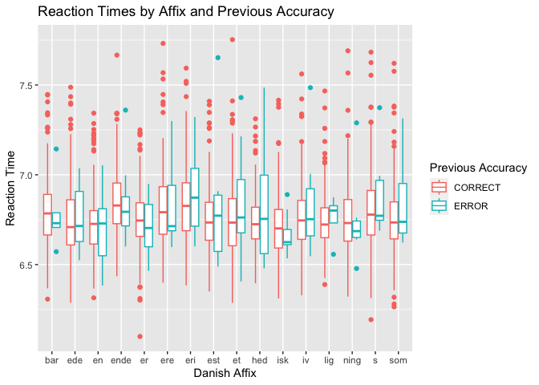

Programming assignment 2
================
Alejandro Jaume Losa
Last update: `rSys.Date()`

``` r
library(tidyverse)
```

    ## ── Attaching packages ─────────────────────────────────────── tidyverse 1.3.2 ──
    ## ✔ ggplot2 3.4.0     ✔ purrr   1.0.1
    ## ✔ tibble  3.1.8     ✔ dplyr   1.1.0
    ## ✔ tidyr   1.3.0     ✔ stringr 1.5.0
    ## ✔ readr   2.1.3     ✔ forcats 1.0.0
    ## ── Conflicts ────────────────────────────────────────── tidyverse_conflicts() ──
    ## ✖ dplyr::filter() masks stats::filter()
    ## ✖ dplyr::lag()    masks stats::lag()

``` r
library(languageR)
```

``` r
english %>%
  ggplot() +
  aes(x = WordCategory, y = RTlexdec) +
  facet_grid(. ~ AgeSubject) +
  stat_summary(fun.data = mean_sdl, geom = "pointrange") +
  labs(x = "Word Category", y = "Reaction Time", title = "Reaction Time by Written Frequency and Age")
```

<!-- -->

``` r
danish %>%
  ggplot() +
  aes(x = Affix, y = LogRT, color = PrevError) +
  geom_boxplot() +
  labs(x = "Danish Affix", y = "Reaction Time", color = "Previous Accuracy", title = "Reaction Times by Affix and Previous Accuracy")
```

<!-- -->

``` r
beginningReaders %>%
  ggplot() +
  aes(x = OrthLength, y = LogRT) +
  geom_point() +
  geom_jitter() +
  labs(x = "Word Length in Letters", y = "Reaction Time", title = "Reaction Time by Word Length")
```

<!-- -->
