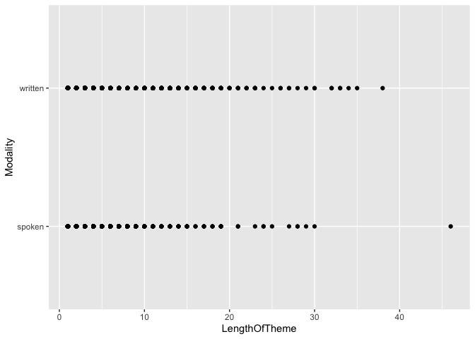
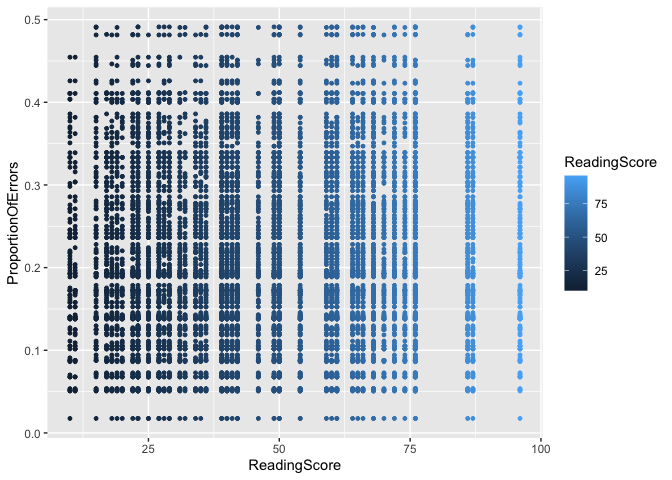
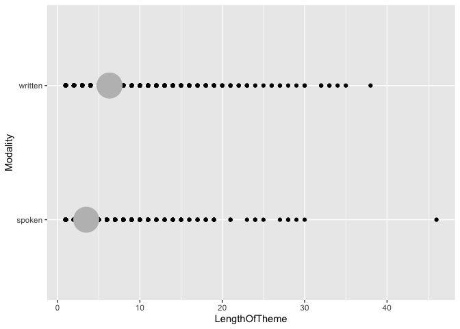

“Programming assignment 2”
================
“Miguel Jimenez”

Esto se esta poniendo dificil .. ahi vamos

<!-- -->

Esta es la pagina de Miguel He hecho varias graficas con Dative pero no
veo una chula

<!-- -->

La siguiente es con Dativo otra vez con un summary en gris de la media

    ## Warning: Removed 2 rows containing missing values (geom_segment).

<!-- -->
