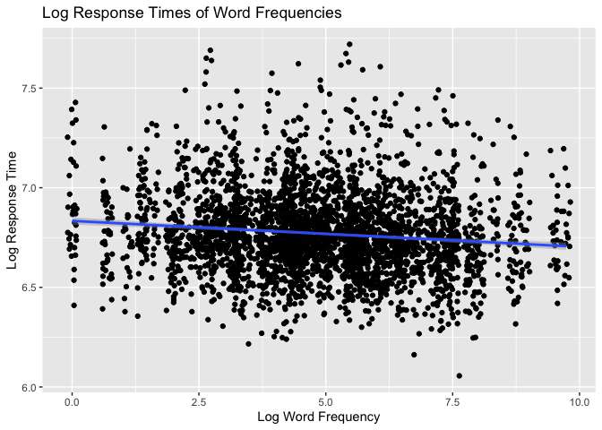
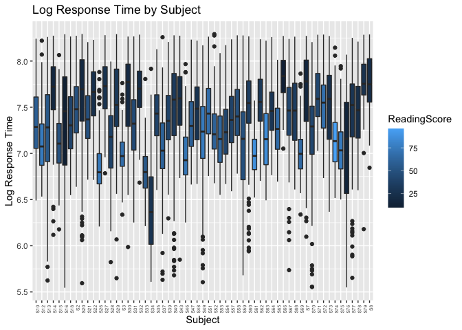
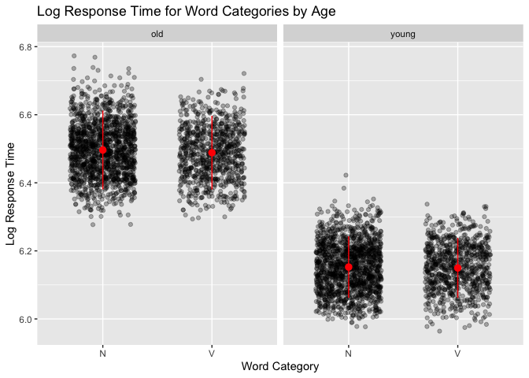

Programming assignment 2
================
Joselyn Rodriguez
Last update: 2021-02-10

``` r
library(tidyverse)
```

    ## ── Attaching packages ─────────────────────────────────────── tidyverse 1.3.0 ──

    ## ✓ ggplot2 3.3.3     ✓ purrr   0.3.4
    ## ✓ tibble  3.0.6     ✓ dplyr   1.0.4
    ## ✓ tidyr   1.1.2     ✓ stringr 1.4.0
    ## ✓ readr   1.4.0     ✓ forcats 0.5.1

    ## ── Conflicts ────────────────────────────────────────── tidyverse_conflicts() ──
    ## x dplyr::filter() masks stats::filter()
    ## x dplyr::lag()    masks stats::lag()

``` r
library(languageR)
```

# Assignment

You must use 3 of the aforementioned datasets (a different dataset for
each plot). All plots must include informative x-, y-axis labels and a
title. The plots you must create are:

### familiarize with datasets

``` r
# some quick looks at the data

summary(beginningReaders)
```

    ##        Word         Subject         LogRT           Trial      
    ##  mus     :  56   S46    : 180   Min.   :5.545   Min.   :  1.0  
    ##  poes    :  56   S52    : 177   1st Qu.:7.001   1st Qu.:126.0  
    ##  sok     :  56   S12    : 174   Median :7.329   Median :242.0  
    ##  oom     :  55   S63    : 174   Mean   :7.318   Mean   :247.8  
    ##  plein   :  55   S74    : 172   3rd Qu.:7.657   3rd Qu.:370.0  
    ##  sprookje:  55   S75    : 171   Max.   :8.294   Max.   :567.0  
    ##  (Other) :7590   (Other):6875                                  
    ##    OrthLength      LogFrequency   LogFamilySize    ReadingScore  
    ##  Min.   : 2.000   Min.   :2.079   Min.   :0.000   Min.   :10.00  
    ##  1st Qu.: 5.000   1st Qu.:3.584   1st Qu.:1.099   1st Qu.:29.00  
    ##  Median : 6.000   Median :4.143   Median :1.386   Median :46.00  
    ##  Mean   : 5.769   Mean   :4.218   Mean   :1.504   Mean   :47.61  
    ##  3rd Qu.: 7.000   3rd Qu.:4.860   3rd Qu.:1.792   3rd Qu.:65.00  
    ##  Max.   :11.000   Max.   :7.029   Max.   :3.807   Max.   :96.00  
    ##                                                                  
    ##  ProportionOfErrors      PC1                PC2                 PC3          
    ##  Min.   :0.01754    Min.   :-6.74895   Min.   :-3.571122   Min.   :-3.35566  
    ##  1st Qu.:0.13793    1st Qu.:-0.85291   1st Qu.:-0.461370   1st Qu.:-0.43199  
    ##  Median :0.19643    Median : 0.20943   Median :-0.009402   Median :-0.00131  
    ##  Mean   :0.21607    Mean   : 0.04015   Mean   : 0.000145   Mean   :-0.00295  
    ##  3rd Qu.:0.29825    3rd Qu.: 1.13255   3rd Qu.: 0.462891   3rd Qu.: 0.41571  
    ##  Max.   :0.49123    Max.   : 3.38085   Max.   : 4.172695   Max.   : 2.97171  
    ##                                                                              
    ##       PC4           
    ##  Min.   :-3.055159  
    ##  1st Qu.:-0.405996  
    ##  Median : 0.005431  
    ##  Mean   : 0.002121  
    ##  3rd Qu.: 0.412868  
    ##  Max.   : 2.926385  
    ## 

``` r
# head(beginningReaders)
summary(danish)
```

    ##     Subject             Word          Affix          LogRT      
    ##  2s08   : 155   appetitlig:  22   est    : 217   Min.   :6.100  
    ##  2s02   : 154   baroner   :  22   isk    : 217   1st Qu.:6.643  
    ##  2s11   : 154   bF8jning  :  22   et     : 216   Median :6.748  
    ##  2s18   : 154   blokere   :  22   ede    : 215   Mean   :6.770  
    ##  2s21   : 154   blomster  :  22   hed    : 215   3rd Qu.:6.873  
    ##  2s10   : 153   bryggeri  :  22   er     : 214   Max.   :7.752  
    ##  (Other):2402   (Other)   :3194   (Other):2032                  
    ##       PC1               PC2             PrevError         Rank          
    ##  Min.   :-6.3661   Min.   :-7.30414   CORRECT:3182   Min.   :-1.689590  
    ##  1st Qu.:-0.3934   1st Qu.:-0.46991   ERROR  : 144   1st Qu.:-0.882087  
    ##  Median : 0.1915   Median : 0.01951                  Median :-0.001174  
    ##  Mean   : 0.0000   Mean   : 0.00000                  Mean   : 0.000000  
    ##  3rd Qu.: 0.6469   3rd Qu.: 0.48517                  3rd Qu.: 0.850375  
    ##  Max.   : 2.1024   Max.   : 5.65189                  Max.   : 1.738628  
    ##                                                                         
    ##  Sex      ResidSemRating       ResidFamSize        LogWordFreq   
    ##  F:1972   Min.   :-3.550223   Min.   :-5.284262   Min.   :0.000  
    ##  M:1354   1st Qu.:-1.065771   1st Qu.:-0.826234   1st Qu.:3.466  
    ##           Median : 0.282918   Median : 0.065899   Median :4.860  
    ##           Mean   : 0.004871   Mean   : 0.007872   Mean   :4.898  
    ##           3rd Qu.: 1.339696   3rd Qu.: 0.919535   3rd Qu.:6.196  
    ##           Max.   : 2.523988   Max.   : 3.178727   Max.   :9.736  
    ##                                                                  
    ##   LogAffixFreq        LogCUP          LogUP        LogCUPtoEnd   
    ##  Min.   : 9.066   Min.   :5.565   Min.   :5.037   Min.   :0.000  
    ##  1st Qu.:11.004   1st Qu.:5.994   1st Qu.:5.478   1st Qu.:4.078  
    ##  Median :12.416   Median :6.129   Median :5.659   Median :4.898  
    ##  Mean   :12.000   Mean   :6.131   Mean   :5.661   Mean   :4.173  
    ##  3rd Qu.:13.395   3rd Qu.:6.267   3rd Qu.:5.849   3rd Qu.:5.236  
    ##  Max.   :14.060   Max.   :6.525   Max.   :6.170   Max.   :5.805  
    ## 

``` r
# head(danish)
summary(dativeSimplified)
```

    ##  RealizationOfRec      Verb        AnimacyOfRec   AnimacyOfTheme
    ##  NP:555           give   :403   animate  :822   animate  :  6   
    ##  PP:348           sell   :130   inanimate: 81   inanimate:897   
    ##                   pay    : 66                                   
    ##                   offer  : 49                                   
    ##                   send   : 33                                   
    ##                   cost   : 32                                   
    ##                   (Other):190                                   
    ##  LengthOfTheme   
    ##  Min.   :0.0000  
    ##  1st Qu.:0.6931  
    ##  Median :1.6094  
    ##  Mean   :1.4982  
    ##  3rd Qu.:2.0794  
    ##  Max.   :3.6376  
    ## 

``` r
# head(dativeSimplified)
summary(english)
```

    ##     RTlexdec        RTnaming      Familiarity         Word      AgeSubject  
    ##  Min.   :6.205   Min.   :6.022   Min.   :1.100   arm    :   4   old  :2284  
    ##  1st Qu.:6.426   1st Qu.:6.149   1st Qu.:3.000   barge  :   4   young:2284  
    ##  Median :6.550   Median :6.342   Median :3.700   bark   :   4               
    ##  Mean   :6.550   Mean   :6.323   Mean   :3.796   bear   :   4               
    ##  3rd Qu.:6.653   3rd Qu.:6.490   3rd Qu.:4.570   beef   :   4               
    ##  Max.   :7.188   Max.   :6.696   Max.   :6.970   bind   :   4               
    ##                                                  (Other):4544               
    ##  WordCategory WrittenFrequency WrittenSpokenFrequencyRatio   FamilySize    
    ##  N:2904       Min.   : 0.000   Min.   :-6.55393            Min.   :0.6931  
    ##  V:1664       1st Qu.: 3.761   1st Qu.:-0.07402            1st Qu.:1.0986  
    ##               Median : 4.832   Median : 0.68118            Median :1.7918  
    ##               Mean   : 5.021   Mean   : 0.67763            Mean   :1.8213  
    ##               3rd Qu.: 6.247   3rd Qu.: 1.44146            3rd Qu.:2.3026  
    ##               Max.   :11.357   Max.   : 5.63071            Max.   :5.5175  
    ##                                                                            
    ##  DerivationalEntropy InflectionalEntropy NumberSimplexSynsets
    ##  Min.   :0.00000     Min.   :0.0000      Min.   :0.000       
    ##  1st Qu.:0.03932     1st Qu.:0.7442      1st Qu.:1.099       
    ##  Median :0.41097     Median :1.0982      Median :1.609       
    ##  Mean   :0.54089     Mean   :1.1186      Mean   :1.708       
    ##  3rd Qu.:0.89323     3rd Qu.:1.6325      3rd Qu.:2.197       
    ##  Max.   :5.20728     Max.   :2.4514      Max.   :4.357       
    ##                                                              
    ##  NumberComplexSynsets LengthInLetters     Ncount       MeanBigramFrequency
    ##  Min.   :0.000        Min.   :2.000   Min.   : 0.000   Min.   : 5.390     
    ##  1st Qu.:0.000        1st Qu.:4.000   1st Qu.: 2.000   1st Qu.: 8.100     
    ##  Median :1.386        Median :4.000   Median : 5.000   Median : 8.559     
    ##  Mean   :1.568        Mean   :4.342   Mean   : 6.266   Mean   : 8.490     
    ##  3rd Qu.:2.565        3rd Qu.:5.000   3rd Qu.: 9.000   3rd Qu.: 8.973     
    ##  Max.   :6.111        Max.   :7.000   Max.   :22.000   Max.   :10.283     
    ##                                                                           
    ##  FrequencyInitialDiphone    ConspelV        ConspelN         ConphonV    
    ##  Min.   : 4.143          Min.   : 0.00   Min.   : 0.000   Min.   : 0.00  
    ##  1st Qu.:11.277          1st Qu.: 6.00   1st Qu.: 4.519   1st Qu.:10.00  
    ##  Median :12.023          Median :11.00   Median : 5.710   Median :16.00  
    ##  Mean   :11.963          Mean   :11.71   Mean   : 5.605   Mean   :18.26  
    ##  3rd Qu.:12.697          3rd Qu.:17.00   3rd Qu.: 6.997   3rd Qu.:24.00  
    ##  Max.   :14.654          Max.   :32.00   Max.   :10.492   Max.   :66.00  
    ##                                                                          
    ##     ConphonN       ConfriendsV     ConfriendsN         ConffV      
    ##  Min.   : 0.000   Min.   : 0.00   Min.   : 0.000   Min.   :0.0000  
    ##  1st Qu.: 5.268   1st Qu.: 4.00   1st Qu.: 4.159   1st Qu.:0.0000  
    ##  Median : 6.340   Median :10.00   Median : 5.487   Median :0.0000  
    ##  Mean   : 6.318   Mean   :10.42   Mean   : 5.265   Mean   :0.4109  
    ##  3rd Qu.: 7.491   3rd Qu.:15.00   3rd Qu.: 6.642   3rd Qu.:0.6931  
    ##  Max.   :10.600   Max.   :31.00   Max.   :10.303   Max.   :3.3322  
    ##                                                                    
    ##      ConffN           ConfbV           ConfbN       NounFrequency     
    ##  Min.   : 0.000   Min.   :0.0000   Min.   : 0.000   Min.   :    0.00  
    ##  1st Qu.: 0.000   1st Qu.:0.6931   1st Qu.: 0.000   1st Qu.:   28.75  
    ##  Median : 0.000   Median :1.3863   Median : 4.143   Median :  108.00  
    ##  Mean   : 1.308   Mean   :1.5570   Mean   : 3.890   Mean   :  600.19  
    ##  3rd Qu.: 1.386   3rd Qu.:2.5649   3rd Qu.: 6.242   3rd Qu.:  424.75  
    ##  Max.   :10.347   Max.   :4.1897   Max.   :10.600   Max.   :35351.00  
    ##                                                                       
    ##  VerbFrequency      CV       Obstruent       Frication          Voice     
    ##  Min.   :     0.0   C:4446   cont:1068   burst    :1840   voiced   :2060  
    ##  1st Qu.:     0.0   V: 122   obst:3500   frication:1660   voiceless:2508  
    ##  Median :    30.0                        long     :  88                   
    ##  Mean   :   881.0                        short    : 980                   
    ##  3rd Qu.:   164.2                                                         
    ##  Max.   :242066.0                                                         
    ##                                                                           
    ##  FrequencyInitialDiphoneWord FrequencyInitialDiphoneSyllable CorrectLexdec  
    ##  Min.   : 3.091              Min.   : 3.367                  Min.   : 1.00  
    ##  1st Qu.: 9.557              1st Qu.:10.000                  1st Qu.:27.00  
    ##  Median :10.517              Median :10.972                  Median :29.00  
    ##  Mean   :10.359              Mean   :10.789                  Mean   :27.05  
    ##  3rd Qu.:11.320              3rd Qu.:11.703                  3rd Qu.:30.00  
    ##  Max.   :13.925              Max.   :13.930                  Max.   :30.00  
    ## 

``` r
# head(english)
summary(spanishFunctionWords)
```

    ##    X14458gll          X14463gll          X14459gll          X14464gll       
    ##  Min.   :0.000000   Min.   :0.000000   Min.   :0.000000   Min.   :0.000000  
    ##  1st Qu.:0.000000   1st Qu.:0.000000   1st Qu.:0.001151   1st Qu.:0.001015  
    ##  Median :0.002331   Median :0.001876   Median :0.003452   Median :0.002030  
    ##  Mean   :0.008334   Mean   :0.008333   Mean   :0.008333   Mean   :0.008333  
    ##  3rd Qu.:0.008159   3rd Qu.:0.006567   3rd Qu.:0.008055   3rd Qu.:0.006091  
    ##  Max.   :0.099068   Max.   :0.120075   Max.   :0.097814   Max.   :0.123858  
    ##    X14460gll          X14465gll          X14461gll          X14466gll       
    ##  Min.   :0.000000   Min.   :0.000000   Min.   :0.000000   Min.   :0.000000  
    ##  1st Qu.:0.000000   1st Qu.:0.000667   1st Qu.:0.000617   1st Qu.:0.000649  
    ##  Median :0.001219   Median :0.002000   Median :0.002158   Median :0.001947  
    ##  Mean   :0.008333   Mean   :0.008333   Mean   :0.008333   Mean   :0.008333  
    ##  3rd Qu.:0.006246   3rd Qu.:0.006000   3rd Qu.:0.006319   3rd Qu.:0.005353  
    ##  Max.   :0.146252   Max.   :0.113333   Max.   :0.131936   Max.   :0.085659  
    ##    X14462gll          X14472gll          X14467gll          X14473gll       
    ##  Min.   :0.000000   Min.   :0.000000   Min.   :0.000000   Min.   :0.000000  
    ##  1st Qu.:0.001157   1st Qu.:0.000659   1st Qu.:0.000649   1st Qu.:0.001247  
    ##  Median :0.002313   Median :0.001978   Median :0.002270   Median :0.003117  
    ##  Mean   :0.008333   Mean   :0.008333   Mean   :0.008334   Mean   :0.008333  
    ##  3rd Qu.:0.008097   3rd Qu.:0.006757   3rd Qu.:0.004540   3rd Qu.:0.007481  
    ##  Max.   :0.090226   Max.   :0.096902   Max.   :0.129702   Max.   :0.086035  
    ##    X14474gll          X14475gll          X14476gll       
    ##  Min.   :0.000000   Min.   :0.000000   Min.   :0.000000  
    ##  1st Qu.:0.001363   1st Qu.:0.000679   1st Qu.:0.000642  
    ##  Median :0.002045   Median :0.002038   Median :0.002569  
    ##  Mean   :0.008333   Mean   :0.008333   Mean   :0.008333  
    ##  3rd Qu.:0.006135   3rd Qu.:0.005435   3rd Qu.:0.005138  
    ##  Max.   :0.124744   Max.   :0.129755   Max.   :0.116249

``` r
# head(spanishFunctionWords)
```

### making plots

1.  A bivariate scatterplot

``` r
# looking at response times across word frequencies. You'd assume the response times would get shorter as frequency increases and it looks to be the case
bivariate_plot <- danish %>% 
    ggplot(aes(x = LogWordFreq, y = LogRT)) +
    geom_point(position = position_jitter(w = 0.1, h = 0.1)) + # jitter a bit horizontally and vertically to see all the points
    geom_smooth(method = "lm") + # add this in to see the general trend
    labs(title = "Log Response Times of Word Frequencies",  x = "Log Word Frequency", y = "Log Response Time")

print(bivariate_plot)
```

    ## `geom_smooth()` using formula 'y ~ x'

<!-- -->

1.  A boxplot with different fill colors

``` r
# this is a graph is a bit crowded, but it shows the subjects' log response times and reading score 
boxplot_plot <- beginningReaders %>% 
    ggplot(aes(x = Subject, y = LogRT, fill = ReadingScore)) +
    geom_boxplot() +
    theme(axis.text.x = element_text(angle = 90, hjust = 1, size = 5)) +
    labs(title = "Log Response Time by Subject", y = "Log Response Time")

print(boxplot_plot)
```

<!-- -->

1.  A plot of your choice that includes a stat\_summary and a facet.

``` r
# graph of the log response time for different word categories faceted across age. It doesn't look like there's a difference
statsummary_plot <- english %>%
    ggplot(aes(x = WordCategory, y = RTnaming)) +
    geom_point(alpha = 0.3, position = position_jitter(w = 0.3, h = 0.1)) + # also jittered this a bit
    stat_summary(color = "red", fun.data = mean_sdl, geom = "pointrange") +
    facet_grid( ~ AgeSubject) +
    labs(title = "Log Response Time for Word Categories by Age", x = "Word Category", y = "Log Response Time")

print(statsummary_plot)
```

<!-- -->
