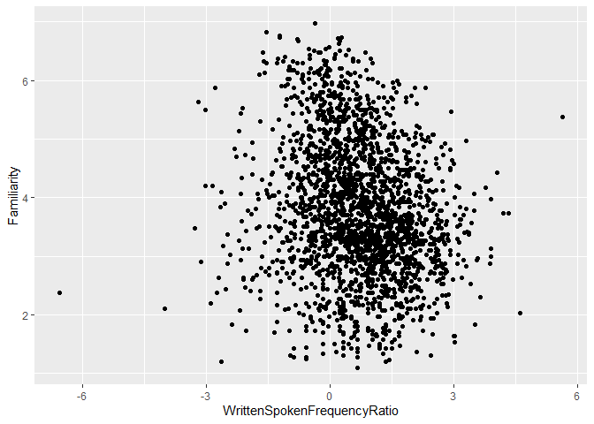
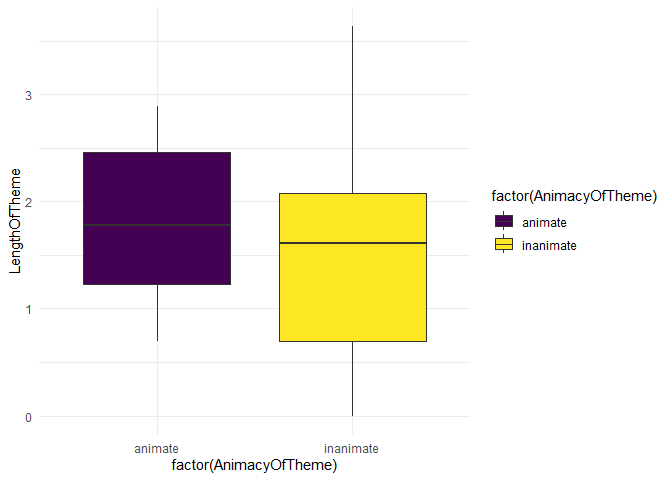
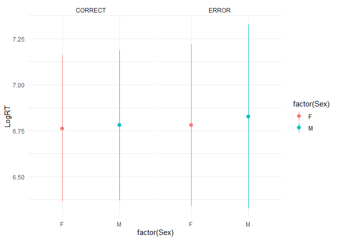

``` r
library("ggplot2")
library("languageR")
library("tidyverse")
```

```
## ── Attaching core tidyverse packages ──────────────────────── tidyverse 2.0.0 ──
## ✔ dplyr     1.1.4     ✔ readr     2.1.5
## ✔ forcats   1.0.0     ✔ stringr   1.5.1
## ✔ lubridate 1.9.4     ✔ tibble    3.2.1
## ✔ purrr     1.0.2     ✔ tidyr     1.3.1
## ── Conflicts ────────────────────────────────────────── tidyverse_conflicts() ──
## ✖ dplyr::filter() masks stats::filter()
## ✖ dplyr::lag()    masks stats::lag()
## ℹ Use the conflicted package (<http://conflicted.r-lib.org/>) to force all conflicts to become errors
```

``` r
library("dplyr")
```


``` r
#A bivariate scatterplot for english DataFrame
english |>
  ggplot() +
  aes(x = WrittenSpokenFrequencyRatio, y = Familiarity) +
  geom_point()
```

<!-- -->


``` r
#A boxplot with different fill colors for dativeSimplified DataFrame
dativeSimplified |>
  ggplot() +
  aes(x = factor(AnimacyOfTheme), y = LengthOfTheme, fill = factor(AnimacyOfTheme)) +
  geom_boxplot() +
  scale_fill_viridis_d() +
  theme_minimal()
```

<!-- -->


``` r
#A plot of your choice that includes a stat_summary and a facet for danish DataFrame

danish |>
  ggplot() +
  aes(x = factor(Sex), y = LogRT, color = factor(Sex)) +
  stat_summary(
    fun.data = mean_sdl,
    geom = 'pointrange'
  ) +
  facet_grid(~ PrevError) +
  theme_minimal()
```

<!-- -->

