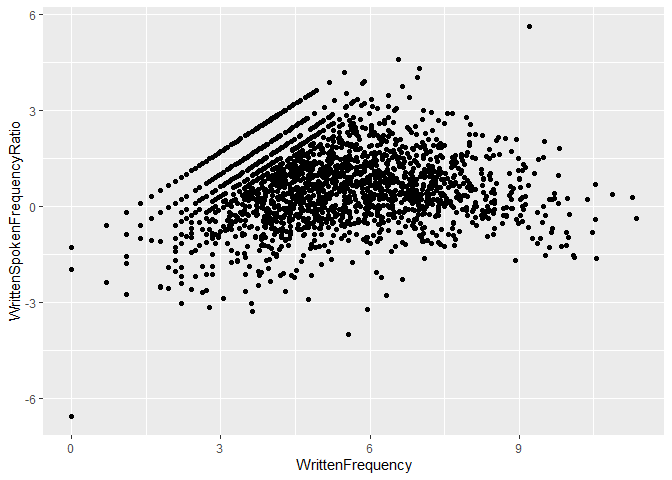
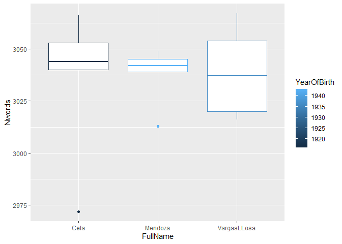
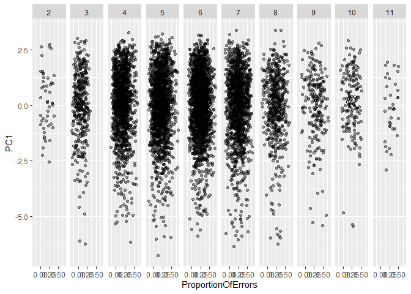
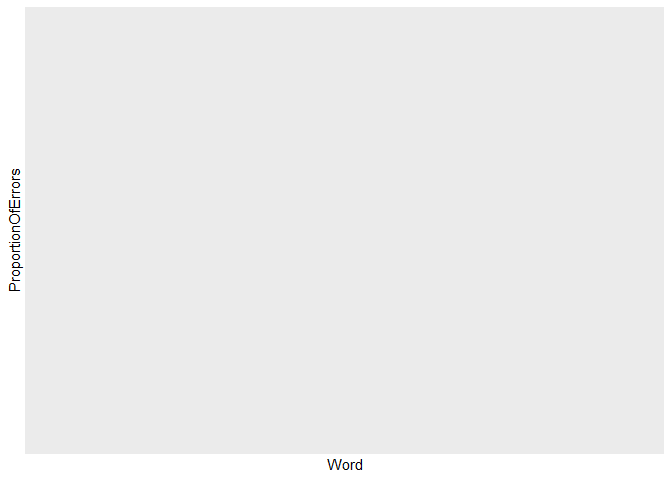

```r
library("tidyverse")
```

```
## ── Attaching packages ─────────────────────────────────────── tidyverse 1.3.2 ──
## ✔ ggplot2 3.4.0     ✔ purrr   1.0.1
## ✔ tibble  3.1.8     ✔ dplyr   1.1.0
## ✔ tidyr   1.3.0     ✔ stringr 1.5.0
## ✔ readr   2.1.3     ✔ forcats 1.0.0
## ── Conflicts ────────────────────────────────────────── tidyverse_conflicts() ──
## ✖ dplyr::filter() masks stats::filter()
## ✖ dplyr::lag()    masks stats::lag()
```

```r
library("languageR")
library("ggplot2")
library("dplyr")
```

## A bivariate scatter plot


```r
english %>%
  ggplot() + 
  aes(x = WrittenFrequency, y = WrittenSpokenFrequencyRatio) +
  geom_point()
```

<!-- -->

## A boxplot with different fill colors

```r
spanishMeta %>%
  ggplot () +
  aes(x = FullName, y = Nwords) + 
  geom_boxplot(aes(colour=YearOfBirth))
```

<!-- -->

## A plot of your choice that includes a stat_summary and a facet.


```r
beginningReaders %>%
  ggplot() +
  aes (x = ProportionOfErrors, y = PC1) +
  facet_grid(. ~ OrthLength) +
  geom_jitter(width = 0.2, height = 0, alpha = 0.4) +
  stat_summary(fun.data = mean_se, geom = "point", pch = 21)
```

<!-- -->

## Trying other plots
#Word seems to have a lot of observations, so it looks very cluttered. I wonder how this can be solved, if Word, a string, can be grouped with stat_summary? I tried with what we learned in class with "select" and "filter" to just show words starting with A, but it does not work. I will keep trying!


```r
beginningReaders %>%
  select(Word,ProportionOfErrors) %>% 
  filter(Word =="^A") %>% 
  ggplot () +
  aes(x = Word, y =ProportionOfErrors) + 
  geom_bar() 
```

<!-- -->


