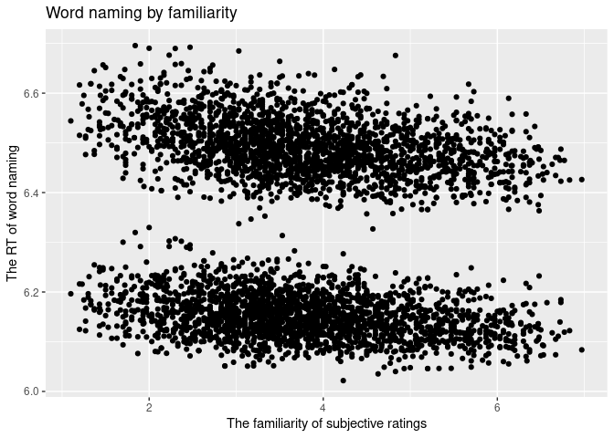
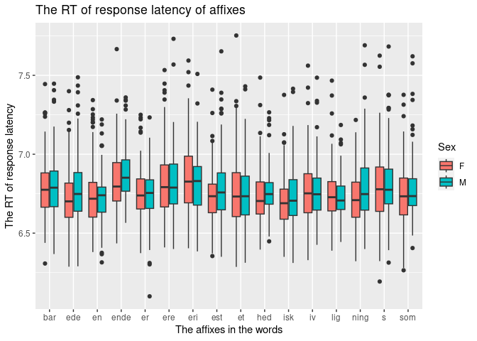
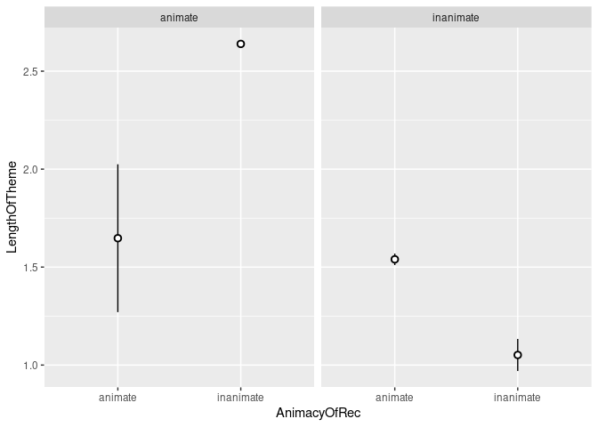

Programming assignment 2
================
Stephanie Rodriguez
2023-02-11

``` r
library("tidyverse")
```

    ## ── Attaching packages ─────────────────────────────────────── tidyverse 1.3.2 ──
    ## ✔ ggplot2 3.4.0     ✔ purrr   1.0.1
    ## ✔ tibble  3.1.8     ✔ dplyr   1.1.0
    ## ✔ tidyr   1.3.0     ✔ stringr 1.5.0
    ## ✔ readr   2.1.3     ✔ forcats 1.0.0
    ## ── Conflicts ────────────────────────────────────────── tidyverse_conflicts() ──
    ## ✖ dplyr::filter() masks stats::filter()
    ## ✖ dplyr::lag()    masks stats::lag()

``` r
library("languageR")
```

``` r
beginningReaders = beginningReaders
danish = danish 
dativeSimplified = dativeSimplified
english = english 
spanishFunctionWords = spanishFunctionWords
```

``` r
view(english)
```

``` r
english %>%
ggplot(aes(x = Familiarity, y = RTnaming)) + 
  geom_point() +
  labs(x = "The familiarity of subjective ratings", y = "The RT of word naming", title = "Word naming by familiarity")
```

<!-- -->

``` r
danish %>%
  ggplot(aes(x = Affix, y = LogRT, fill = Sex)) +
  geom_boxplot() +
    labs(x = "The affixes in the words", y = "The RT of response latency", title = "The RT of response latency of affixes")
```

<!-- -->

``` r
view(dativeSimplified)
```

``` r
 dativeSimplified %>%
  ggplot(aes(x = AnimacyOfRec, y = LengthOfTheme)) +
   stat_summary(fun.data = mean_se, geom = "pointrange", 
               pch = 21, fill = "white") +
  facet_grid(. ~ AnimacyOfTheme)
```

    ## Warning: Removed 1 rows containing missing values (`geom_segment()`).

<!-- -->
