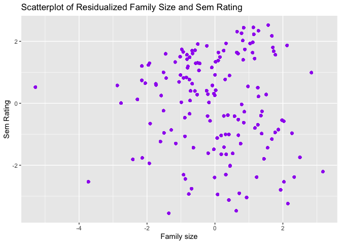
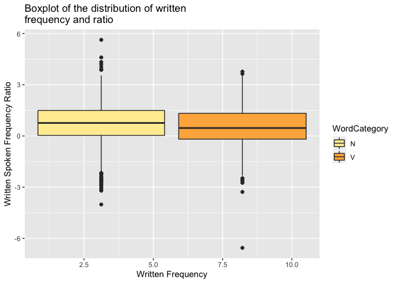
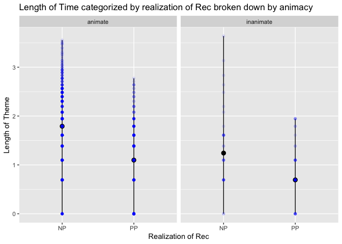

Programming assignment 2
================
Jessica Varela
Last update: 2021-02-10

## Including Plots

You can also embed plots, for example:

``` r
ggplot(data = danish) + geom_point(mapping = aes(x = ResidFamSize, y = ResidSemRating), color = "purple") + xlab("Family size") + ylab("Sem Rating") + ggtitle("Scatterplot of Residualized Family Size and Sem Rating")
```

<!-- -->

``` r
ggplot(data = english, aes(x = WrittenFrequency, y = WrittenSpokenFrequencyRatio, fill = WordCategory)) + geom_boxplot() + xlab("Written Frequency") + ylab("Written Spoken Frequency Ratio") + ggtitle("Boxplot of the distribution of written
frequency and ratio") + scale_fill_brewer(palette="YlOrRd")
```

<!-- -->

``` r
ggplot(data = dativeSimplified) + stat_summary(mapping = aes(x = RealizationOfRec, y = LengthOfTheme), fun.min = min, fun.max = max, fun = median) + geom_point(data = dativeSimplified, aes(x = RealizationOfRec, y = LengthOfTheme), alpha = .1, color = "blue") + facet_wrap(~ AnimacyOfRec, nrow = 1)  + xlab("Realization of Rec") + ylab("Length of Theme") + ggtitle("Length of Time categorized by realization of Rec broken down by animacy")
```

<!-- -->

Note that the `echo = FALSE` parameter was added to the code chunk to
prevent printing of the R code that generated the plot.
