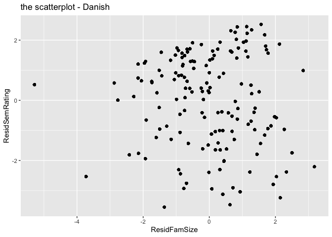
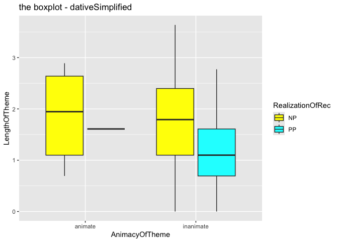
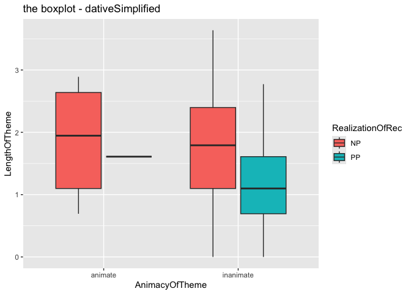
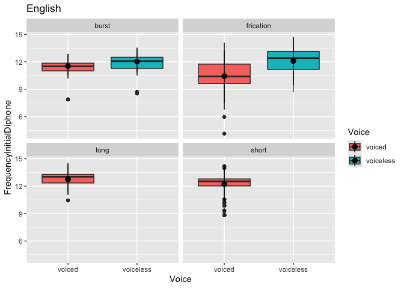

``` r
library("languageR")
library("tidyverse")
```


``` r
danish |> 
  ggplot() +
  aes(x = ResidFamSize, y = ResidSemRating)+
  geom_point()+
  ggtitle("the scatterplot - Danish")
```

<!-- -->


``` r
dativeSimplified |> 
  ggplot() +
  aes(x = AnimacyOfTheme, y = LengthOfTheme, fill = RealizationOfRec) +
  geom_boxplot() +
  scale_fill_manual(values = c("NP" = "yellow", "PP" = "cyan")) +
  ggtitle("the boxplot - dativeSimplified")
```

<!-- -->


``` r
dativeSimplified |> 
  ggplot() +
  aes(x = AnimacyOfTheme, y = LengthOfTheme, fill = RealizationOfRec) +
  geom_boxplot() +
  ggtitle("the boxplot - dativeSimplified")
```

<!-- -->


``` r
english |> 
  ggplot() +
  aes(x = Voice, y = FrequencyInitialDiphone, fill = Voice)+
  geom_boxplot() +
  stat_summary(
    fun.data = mean_sdl) +
  facet_wrap(~Frication) +
   ggtitle("English")
```

<!-- -->

