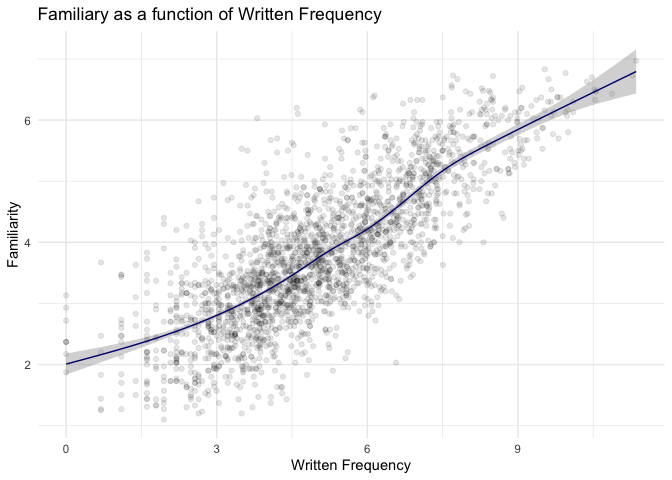
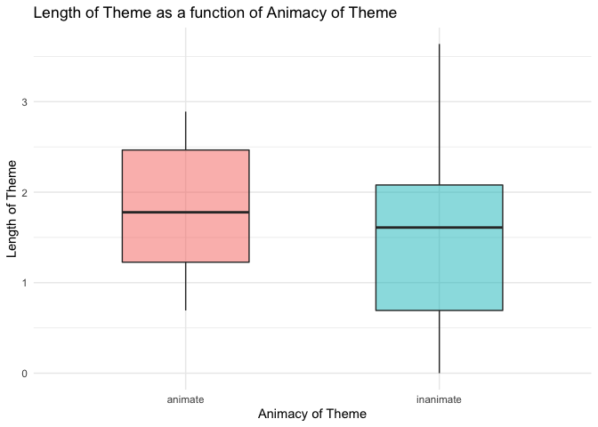
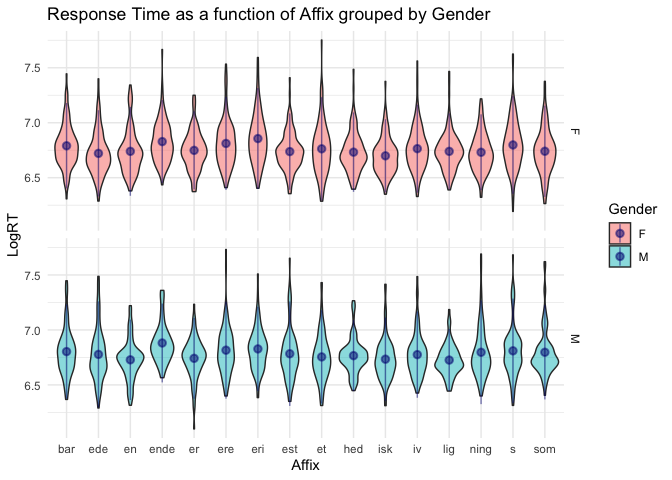

Programming assignment 2
================
Ziling Zhu
Last update: 2021-02-09

## Setup

``` r
library(languageR)
library(tidyverse)
```

    ## ── Attaching packages ─────────────────────────────────────── tidyverse 1.3.0 ──

    ## ✓ ggplot2 3.3.3     ✓ purrr   0.3.4
    ## ✓ tibble  3.0.5     ✓ dplyr   1.0.3
    ## ✓ tidyr   1.1.2     ✓ stringr 1.4.0
    ## ✓ readr   1.4.0     ✓ forcats 0.5.1

    ## ── Conflicts ────────────────────────────────────────── tidyverse_conflicts() ──
    ## x dplyr::filter() masks stats::filter()
    ## x dplyr::lag()    masks stats::lag()

## Scatterplot

Based on the data in the package **english**, the following scatterplot
shows that the more frequently a word is written, the more familiar
English users rate it to be.

``` r
english %>% 
  ggplot() +
  aes(x = WrittenFrequency, y = Familiarity) +
  geom_point(alpha = 0.05) +
  geom_smooth(color = "navy", size = 0.5) +
  labs(x = "Written Frequency", y = "Familiarity",
       title = "Familiary as a function of Written Frequency") +
  theme_minimal()
```

    ## `geom_smooth()` using method = 'gam' and formula 'y ~ s(x, bs = "cs")'

<!-- -->

## Boxplot

Based on the data in the package **dativeSimplified**, the following
boxplot shows that animate themes have more words than inanimate themes.

``` r
dativeSimplified %>% 
  ggplot() +
  aes(x = AnimacyOfTheme, y = LengthOfTheme, fill = AnimacyOfTheme) +
  geom_boxplot(width = 0.5, alpha = 0.5, show.legend = FALSE) +
  labs(x = "Animacy of Theme", y = "Length of Theme",
       title = "Length of Theme as a function of Animacy of Theme") +
  theme_minimal()
```

<!-- -->

## Plot of my choice

Based on the data in the package **danish**, the following violin plot
shows the gender variations in the (log-transformed) response time for
each affix (not sure if it’s linguistically meaningful).

``` r
danish %>%
  ggplot() + 
  aes(x = Affix, y = LogRT, fill = Sex) +
  geom_violin(alpha = 0.5) +
  stat_summary(fun.data = mean_sdl, geom = "pointrange",
               alpha = 0.5, color = "navy") +
  facet_grid(Sex ~ .) +
  labs(x = "Affix", y = "LogRT",
       title = "Response Time as a function of Affix grouped by Gender",
       fill = "Gender") +
  theme_minimal()
```

<!-- -->
